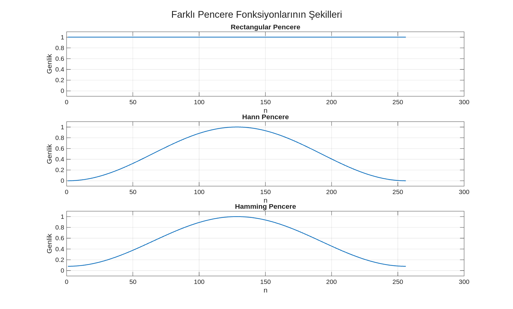

# FFT Analizinde Çözünürlük, Sızıntı ve Pencereleme Etkileri

Bu teknik notlar, Dijital Sinyal İşleme (DSP) alanında Hızlı Fourier Dönüşümü (FFT) tabanlı spektral analizlerin temel prensiplerini ve pratik uygulamalarını kapsamaktadır. Temel amaç, FFT grafiklerinin yalnızca sinyalin doğal frekans içeriğini değil, aynı zamanda kullanılan analiz parametrelerinin (kayıt süresi, pencere fonksiyonu gibi) etkilerini de yansıttığını vurgulamaktır. Okuyucuların, FFT sonuçlarını yorumlarken daha eleştirel ve sorgulayıcı bir bakış açısı geliştirmesi hedeflenmektedir.

---

## 1. Frekans Çözünürlüğü

Frekans çözünürlüğü, bir sinyalin spektrumunda birbirine yakın frekans bileşenlerini ne kadar net ayırt edebildiğimizi ifade eden kritik bir parametredir. FFT algoritması, frekans eksenini sürekli bir yapı olarak değil, belirli ayrık frekans "kutuları" (bins) halinde örnekler. Bu frekans kutularının genişliği, yani $\Delta f$, aşağıdaki formülle belirlenir:

$$
\Delta f = \frac{F_s}{N} = \frac{1}{T}
$$

Burada:
*   $F_s$: Örnekleme frekansı (Hz)
*   $N$: FFT hesaplamasında kullanılan örnek sayısı
*   $T$: Sinyalin kayıt süresi (saniye), $T = N/F_s$

Bu formülden de anlaşılacağı üzere, örnekleme frekansı ($F_s$) sabit tutulduğunda, $N$ değeri (dolayısıyla kayıt süresi $T$) arttıkça $\Delta f$ değeri küçülür. Daha küçük bir $\Delta f$ değeri, frekans ekseninde daha "ince" bir örnekleme anlamına gelir ve bu da bize birbirine yakın frekans bileşenlerini daha başarılı bir şekilde ayırt etme yeteneği kazandırır.

**Örnek Uygulama:**
Yakın frekanslara sahip (örneğin 50 Hz ve 52 Hz) bir sinyal ele alındığında, kısa kayıt süreleri bu iki bileşeni tek bir geniş tepe olarak gösterebilir. Kayıt süresi uzatıldığında ise, iki ayrı tepe net bir şekilde birbirinden ayrılır. Bu durum, MATLAB üzerinde `resolution_demo.m` betiği ile gözlemlenebilir.

<p align="center">
  
  <br>
  <em>Şekil 1: Aynı sinyalin kısa ve uzun kayıt süreleri ile elde edilen FFT spektrumlarının karşılaştırılması. Uzun kayıt süresi, yakın frekansların daha iyi ayrıştırılmasını sağlamıştır.</em>
</p>

---

## 2. Zero-Padding (Sıfır Ekleme)

Zero-padding, bir sinyalin sonuna sıfır değerleri ekleyerek FFT boyutunu yapay olarak artırma tekniğidir. Bu işlem, spektrumun frekans ekseninde daha sık noktalarda örneklenmesini sağlar ve böylece FFT grafiği daha pürüzsüz ve sürekli bir görünüm kazanır. Zero-padding'in temel faydaları şunlardır:

*   **Görselleştirme İyileşmesi:** Spektral tepelerin daha yuvarlak ve belirgin görünmesini sağlar, bu da tepe frekanslarının daha hassas bir şekilde okunmasına yardımcı olur.
*   **Frekans Adımı Küçülmesi:** Spektrumdaki frekans adımı ($F_s / N_{padded}$) küçülür, bu da spektrumun daha "yoğun" çizilmesini sağlar.

Ancak, zero-padding'in temel bir sınırlaması vardır: **sinyale yeni bir fiziksel bilgi eklemez.** Gerçek frekans çözünürlüğü (yani, iki ayrı frekansı ayırt etme yeteneği) yalnızca sinyalin orijinal kayıt süresine ($T$) bağlıdır. Zero-padding, mevcut spektral bilginin daha detaylı bir şekilde görselleştirilmesini sağlayan bir interpolasyon (iç değerleme) aracı olarak düşünülmelidir.

**Örnek Uygulama:**
`zeropadding_demo.m` betiği, aynı sinyal için hem normal FFT hem de zero-padding uygulanmış FFT spektrumlarını karşılaştırır. Sıfır ekleme sonrasında spektrumun daha akıcı hale geldiği, ancak mevcut frekans bileşenlerinin yerlerinin değişmediği ve yeni bileşenlerin ortaya çıkmadığı gözlemlenir.

<p align="center">
  
  <br>
  <em>Şekil 2: Zero-padding'in FFT spektrumu üzerindeki etkisi. Sıfır ekleme, spektrumu daha sık örnekleyerek görsel pürüzsüzlüğü artırır, ancak gerçek çözünürlüğü iyileştirmez.</em>
</p>

---

## 3. Spektral Sızıntı (Spectral Leakage)

Spektral sızıntı (leakage), sonlu kayıt süresiyle analiz edilen sinyallerde karşılaşılan önemli bir olgudur. İdeal bir senaryoda, tek frekanslı bir sinüs dalgasının FFT spektrumunda tek ve keskin bir çizgi (delta fonksiyonu) olarak görünmesi beklenir. Ancak pratikte, FFT uygulanan sinyal parçası genellikle sinyalin periyodik yapısıyla tam olarak uyumlu değildir. Bu durum, zaman alanında sinyalin başlangıç ve bitiş noktalarında ani (keskin) geçişlere, yani süreksizliklere yol açar.

FFT algoritması, bu ani geçişleri açıklamak için sinyal enerjisini tek bir frekans bin'inde toplamak yerine, komşu frekans bin'lerine de dağıtır. Bu "enerji yayılımına" spektral sızıntı denir. Sızıntı, spektrumda ana tepenin genişlemesine ve etrafında yan lobların oluşmasına neden olur; bu da gerçekte var olmayan frekans bileşenlerinin varmış gibi görünmesine veya zayıf bileşenlerin gizlenmesine yol açabilir.

**Örnek Uygulama:**
`leakage_demo.m` betiği, bin'e tam oturan (örneğin $\Delta f = 1$ Hz için 50 Hz) ve bin'e oturmayan (örneğin 50.5 Hz) tek frekanslı sinyallerin FFT spektrumlarını karşılaştırır. Bin'e oturmayan frekansın spektrumunda belirgin bir sızıntı ve yan lob oluşumu gözlemlenir.

<p align="center">
  
  <br>
  <em>Şekil 3: Bin'e tam oturan (üst) ve oturmayan (alt) tek tonlu sinyallerin FFT spektrumları. Bin'e oturmayan sinyalde belirgin spektral sızıntı ve yan loblar gözlemlenmektedir.</em>
</p>

---

## 4. Pencereleme (Windowing)

Pencereleme, spektral sızıntı etkisini azaltmak ve FFT spektrumunun kalitesini artırmak için kullanılan bir ön işlem tekniğidir. Bu yöntem, sinyali doğrudan ve ani bir şekilde kesmek yerine, zaman domeni sinyalinin uçlarını yumuşak bir şekilde sıfıra yaklaştıran bir "pencere fonksiyonu" ile çarparak süreksizlikleri minimize eder.

Pencere fonksiyonları, ana lob genişliği ile yan lob bastırması arasında bir denge (trade-off) sunar. Farklı pencere türleri, bu dengeyi farklı şekillerde optimize eder:

*   **Rectangular (Dikdörtgen) Pencere:** Bu pencere, sinyale hiçbir değişiklik yapmadan doğrudan uygular. Zaman domeninde en keskin kesimi temsil eder ve spektral sızıntının en belirgin olduğu durumdur. Yan lob bastırması düşüktür ancak ana lobu en dar olan pencere türüdür.
*   **Hann Pencere:** Sinyalin uçlarını kosinüs bir eğri ile yumuşatan, genel amaçlı ve sıklıkla tercih edilen bir penceredir. Rectangular pencereye göre yan lobları önemli ölçüde bastırır, ancak ana lobu bir miktar genişler.
*   **Hamming Pencere:** Hann penceresine benzer bir yapıya sahiptir ancak yan lob bastırmasında hafif farklılıklar gösterir. Genellikle Hann penceresine göre daha iyi yan lob bastırması sunar.

### 4.1. Pencere Fonksiyonlarının Şekilleri

Farklı pencere fonksiyonlarının zaman domenindeki şekilleri, uyguladıkları yumuşatma etkisini görselleştirir. `window_shapes.m` betiği, Rectangular, Hann ve Hamming pencerelerinin karakteristik formlarını çizdirir.

<p align="center">
  
  <br>
  <em>Şekil 4: Rectangular, Hann ve Hamming pencere fonksiyonlarının zaman domenindeki şekilleri. Rectangular pencere düz bir yapıya sahipken, Hann ve Hamming pencereleri sinyalin uçlarını yumuşakça sıfıra yaklaştırır.</em>
</p>

### 4.2. Pencerelemenin Spektral Etkisi

Farklı pencere fonksiyonlarının spektral sızıntı üzerindeki etkilerini karşılaştırmak, pencere seçiminin önemini ortaya koyar. `windowing_comparison.m` betiği, aynı tek tonlu sinyale (bin'e oturmayan 50.5 Hz) Rectangular, Hann ve Hamming pencerelerini uygulayarak elde edilen FFT spektrumlarını karşılaştırır. Hann ve Hamming pencerelerinin, Rectangular pencereye kıyasla yan lobları belirgin şekilde bastırdığı, ancak ana lobun bir miktar genişlediği gözlemlenir.

<p align="center">
  
  <br>
  <em>Şekil 5: Aynı tek tonlu sinyale uygulanan Rectangular, Hann ve Hamming pencerelerinin FFT spektrumları. Hann ve Hamming pencereleri yan lobları bastırırken, ana lobu bir miktar genişletmiştir.</em>
</p>

---

## 5. Gerçek Veri Uygulamaları

Teorik pencereleme prensipleri, gerçek dünya sinyallerine uygulandığında, analiz parametrelerinin yorum üzerindeki etkisi daha belirgin hale gelir. Gerçek veriler genellikle gürültü, çoklu frekans bileşenleri ve dinamik değişimler içerir.

### 5.1. Ses Sinyali Analizi

Ses sinyalleri, formant bölgeleri, temel ton ve harmonik yapılar gibi zengin frekans içeriğine sahiptir. `audio_windowing.m` betiği, kısa bir ses segmentine (örneğin `euphoric.wav` dosyasından) Rectangular, Hann ve Hamming pencereleri uygulayarak spektral etkileri inceler. Gerçek ses verisinde, farklı pencerelerin spektrumun genel görünümünü, özellikle gürültü ve yan bileşenlerin bastırılmasını nasıl etkilediği gözlemlenebilir.

<p align="center">
  
  <br>
  <em>Şekil 6: Gerçek bir ses sinyali segmentine uygulanan farklı pencere fonksiyonlarının FFT spektrumları. Pencereleme, spektrumun daha kontrollü ve yorumlanabilir bir hale gelmesini sağlar.</em>
</p>

### 5.2. Motor Titreşim Verisi Analizi

Endüstriyel uygulamalarda, motor titreşim verileri arıza tespiti ve durum izleme için kritik öneme sahiptir. Bu veriler genellikle dönme frekansları, harmonikler ve çeşitli rezonans bileşenlerini içerir. `motor_windowing.m` betiği, bir motor titreşim sinyali segmentine (örneğin `B007_1_123.mat` dosyasından) farklı pencereler uygulayarak spektral yanıtı analiz eder. Bu tür uygulamalarda, **sinyalin DC ofsetini temizlemek (`seg = seg - mean(seg)`)** önemlidir, çünkü DC bileşenler spektrumda 0 Hz'de büyük bir tepeye yol açarak diğer düşük frekanslı bileşenlerin görünürlüğünü azaltabilir.

<p align="center">
  
  <br>
  <em>Şekil 7: Gerçek bir motor titreşim sinyali segmentine uygulanan farklı pencere fonksiyonlarının FFT spektrumları. Pencere seçimi, arıza imzalarının ve dönme bileşenlerinin daha net ayırt edilmesinde kritik rol oynar.</em>
</p>

---

## 6. Uygulama Akışı ve En İyi Uygulamalar: FFT Analizinde Bilinçli Kararlar

FFT analizinin başarısı, yalnızca doğru algoritmayı kullanmaya değil, aynı zamanda analiz parametrelerini bilinçli bir şekilde seçmeye de bağlıdır. Aşağıda, bir sinyalin FFT'sini almadan önce göz önünde bulundurulması gereken adımlar ve en iyi uygulamalar özetlenmiştir:

1.  **Amacı Belirle:** FFT analizinden ne tür bilgi elde etmek istediğinizi netleştirin (baskın frekans, yakın frekansları ayırma, gürültü analizi vb.).
2.  **Örnekleme Frekansını ($F_s$) Sorgula:** Nyquist kriterine göre $F_s$'in analiz edilecek en yüksek frekansın en az iki katı olduğundan emin olun. Pratik uygulamalarda, aliasing'i önlemek için daha yüksek bir $F_s$ tercih edilebilir.
3.  **Kayıt Süresi ($T$) ve Örnek Sayısını ($N$) Bilinçli Seç:** Yakın frekansları ayırt etmek için yeterince uzun bir kayıt süresi seçmek kritiktir. Unutmayın, gerçek frekans çözünürlüğü esas olarak kayıt süresi ile belirlenir.
4.  **Segment Seçimini Bilinçli Yap:** Tüm sinyal yerine, ilginç veya durağan bir bölgeyi içeren kısa bir segment seçmek, analizi daha odaklı hale getirebilir.
5.  **Ön İşlem Uygula (Gerekirse):**
    *   **DC Ofset Temizliği:** `x = x - mean(x)` ile DC bileşenin giderilmesi, 0 Hz civarındaki büyük tepeyi önler ve diğer düşük frekanslı bileşenleri daha görünür hale getirir.
    *   **Normalizasyon:** Karşılaştırmalı analizlerde genlik ölçeğini standartlaştırmak faydalı olabilir.
6.  **Pencere Seçimini Bilinçli Yap:**
    *   Rectangular: Sızıntı belirgin olabilir, keskin geçişler.
    *   Hann/Hamming: Yan lobları bastırır, daha kontrollü spektrum görünümü sağlar, ancak ana lobu genişletebilir. Genel amaçlı kullanımlar için Hann genellikle iyi bir başlangıç noktasıdır.
7.  **Zero-Padding'i Doğru Anla:** Zero-padding, spektrumu görsel olarak iyileştirir ve tepe okumalarını kolaylaştırır, ancak gerçek çözünürlüğü artırmaz veya yeni bilgi eklemez.
8.  **Tek Taraflı / Çift Taraflı Spektrumu Doğru Kullan:** Gerçek değerli sinyaller için genellikle tek taraflı spektrum kullanılır ve DC ile Nyquist hariç genlikler 2 ile çarpılır. Frekans ekseninin doğru kurulduğundan emin olun.
9.  **Grafiği Yorumla:** Elde edilen FFT grafiğindeki her tepeyi sorgulayın: Gerçek bir bileşen mi, yoksa sızıntı veya analiz artefaktı mı? Pencereleme veya kayıt süresi değişikliklerinin yorumu nasıl etkilediğini değerlendirin.
10. **Sonuçları Bağlama Göre Yorumla:** Analiz sonuçlarını sinyalin fiziksel kaynağına (ses, motor, biyomedikal vb.) göre yorumlayın ve elde edilen spektral bilginin ilgili alandaki anlamını değerlendirin.

**Genel FFT Analiz Şablonu:**

```matlab
% x: sinyal, Fs: örnekleme frekansı
x = x(:);               % Sütun vektörüne dönüştür
x = x - mean(x);        % DC temizliği (gerekirse)

N = length(x);          % Sinyal uzunluğu
w = hann(N);            % Hann penceresi uygula (veya ones(N,1), hamming(N) kullanılabilir)
xw = x .* w;            % Sinyali pencere ile çarp

X = fft(xw)/N;          % FFT hesapla ve normalize et
K = floor(N/2)+1;       % Tek taraflı spektrum için indeks
f = (0:K-1)*(Fs/N);     % Frekans ekseni oluştur

mag = abs(X(1:K));      % Genlik spektrumunu al
mag(2:end-1) = 2*mag(2:end-1); % DC ve Nyquist hariç genlikleri 2 ile çarp (tek taraflı kuralı)

figure;
plot(f, mag, 'LineWidth', 1.2); grid on
xlabel('Frekans (Hz)')
ylabel('|FFT|')
title('Tek Taraflı Genlik Spektrumu')
```
