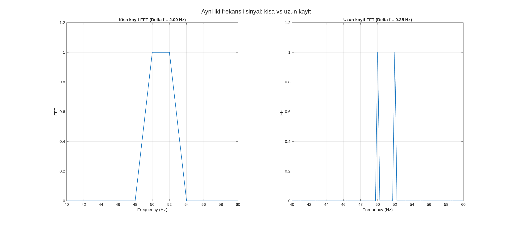
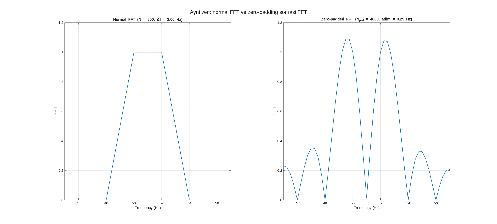
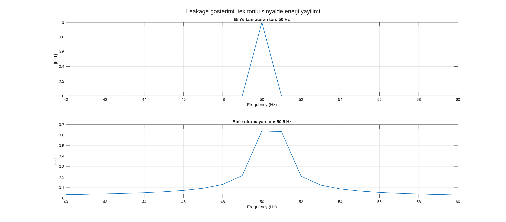
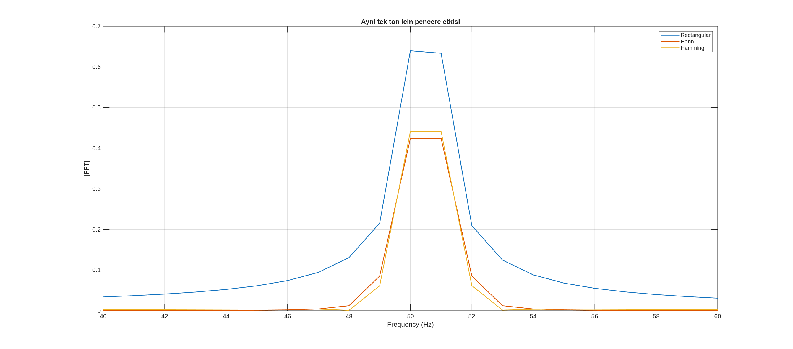
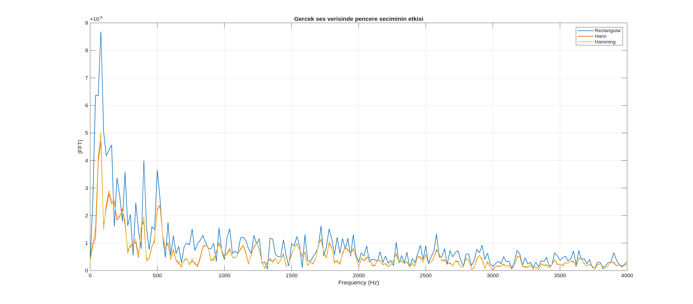
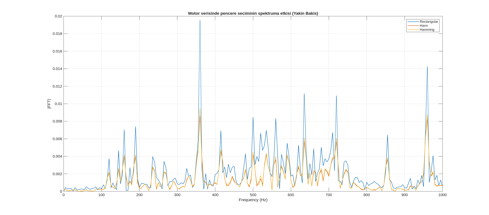

# FFT Analizinde Çözünürlük ve Pencereleme Üzerine Teknik Notlar

Sinyal işleme süreçlerinde FFT grafiği analiz edilirken, elde edilen sonuçların sadece sinyalin karakteristiğini değil, aynı zamanda seçilen analiz parametrelerini de yansıttığı görülmektedir. Bu dokümanda; frekans bileşenlerinin ayırt edilmesi, spektral yayılımın nedenleri ve bu etkilerin kontrol altına alınması için uygulanan yöntemler teknik bir bakış açısıyla özetlenmiştir.

---

### Frekans Çözünürlüğü

FFT analizinde frekans eksenindeki detay seviyesi, doğrudan sinyalin kayıt süresine (T) bağlıdır. $\Delta f = F_s / N = 1/T$ formülü ile ifade edilen bu durumda, analiz süresi uzatıldığında frekans adımlarının küçüldüğü gözlemlenir. Örneğin, birbirine yakın frekans bileşenleri (50 Hz ve 52 Hz gibi) içeren bir sinyalde kayıt süresi yetersiz tutulursa, bu bileşenler spektrumda tek bir geniş tepe olarak görülür. Bu durum, sistemde tek bir frekans olduğu yanılsamasına yol açabilir. Çözünürlüğü iyileştirmenin ve yakın bileşenleri ayrıştırmanın temel yolu, kayıt süresini artırarak daha fazla veri toplamaktır.

  

---

### Zero-Padding

Sinyalin sonuna sıfır değerleri eklenerek (zero-padding) FFT hesaplanması, spektrumun frekans ekseninde daha sık noktalarda örneklenmesini sağlar. Bu işlem sonucunda grafik daha pürüzsüz bir görünüm kazanır ve tepe noktalarının (peak) hangi frekansa denk geldiği daha hassas bir şekilde belirlenebilir. Ancak, bu yöntemin sinyale yeni bir fiziksel bilgi eklemediği ve gerçek frekans çözünürlüğünü (iki yakın frekansı ayırma gücünü) değiştirmediği unutulmamalıdır. Zero-Padding, mevcut spektral bilginin daha detaylı çizdirilmesini sağlayan bir görselleştirme aracı olarak değerlendirilir.

  

---

### Spektral Sızıntı (Leakage)

İdeal koşullarda tek bir frekanstaki sinüzoidal sinyalin, FFT spektrumunda tek bir dikey çizgi olarak ortaya çıkması beklenir. Ancak sinyal, sonlu bir zaman penceresi içinde kesildiğinde, bu kesim noktaları süreksizliklere neden olur. İncelenen frekans bileşeni FFT bin (frekans kutusu) noktalarına tam olarak denk gelmiyorsa, enerji bu kutudan komşu frekanslara yayılır. Spektral sızıntı (leakage) olarak adlandırılan bu olay, spektrumda tepelerin genişlemesine ve yapay bileşenlerin oluşmuş gibi görünmesine yol açar.

  

---

### Pencereleme (Windowing)

Spektral sızıntı etkisini azaltmak amacıyla, sinyali aniden kesmek yerine kenar değerlerini yumuşatarak sıfıra indiren pencereleme (windowing) fonksiyonları kullanılır. Rectangular (dikdörtgen) pencere kullanıldığında sızıntı etkisi ve yan loblar daha belirgin olurken; Hann veya Hamming gibi pencereler tercih edildiğinde bu sızıntıların önemli ölçüde bastırıldığı görülür. Ancak bu bastırma işleminin bedeli olarak ana tepe (main lobe) genişler. Bu durum, yan lobların temizlenmesi ile frekans çözünürlüğü arasında bir ödünleşim (trade-off) yapılmasını zorunlu kılar.

  

---

### Gerçek Veri Uygulamaları

Teorik prensipler ses kayıtları veya motor titreşim verileri gibi gerçek sinyaller üzerinde denendiğinde, analiz parametrelerinin önemi daha net anlaşılmaktadır. Gerçek dünya sinyalleri genellikle gürültülü ve karmaşık yapılara sahiptir. Bu süreçte DC ofsetin temizlenmesi, uygun kayıt sürenin belirlenmesi ve doğru pencere fonksiyonunun seçilmesi, spektrumdan anlamlı fiziksel çıkarımlar yapılmasını sağlayan temel adımlardır.

  
  

---

**Uygulama Notları:**
- Analiz öncesinde `x = x - mean(x)` işlemi ile DC ofset temizlenmelidir.
- Yakın frekans bileşenlerini ayırmak için kayıt süresi (T) artırılmalıdır.
- Sızıntıyı (leakage) minimize etmek için Hann penceresi genel amaçlı analizlerde tercih edilir.
- Zero-padding, sadece tepe noktalarını daha hassas okumak amacıyla bir görselleştirme yöntemi olarak kullanılmalıdır.
