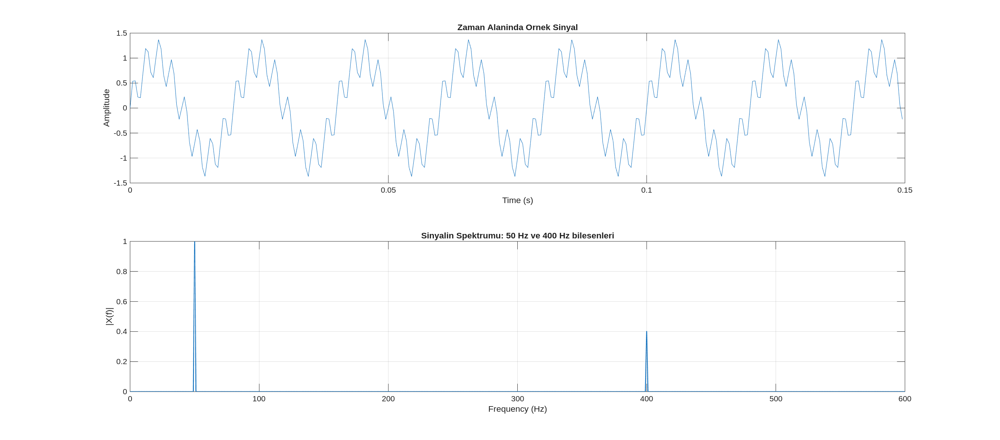
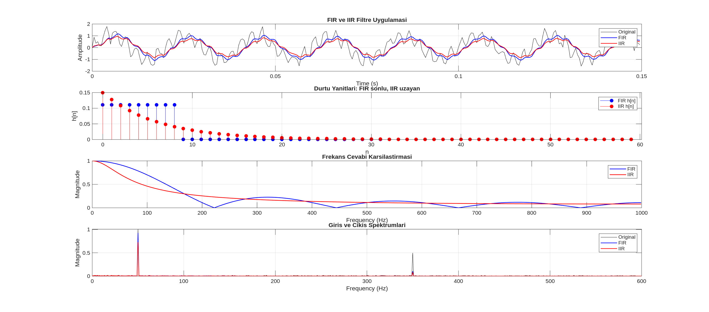
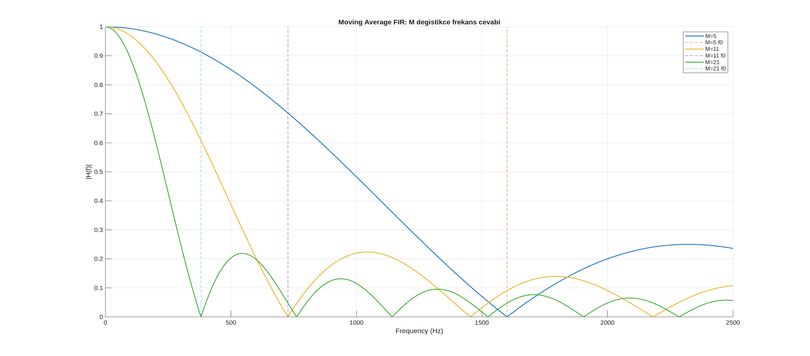
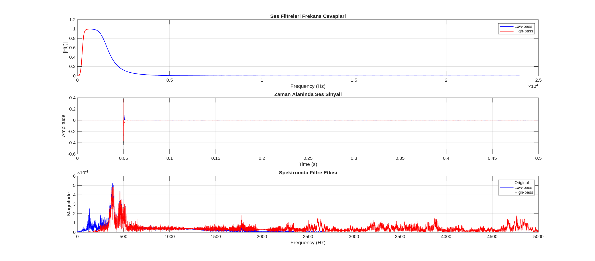
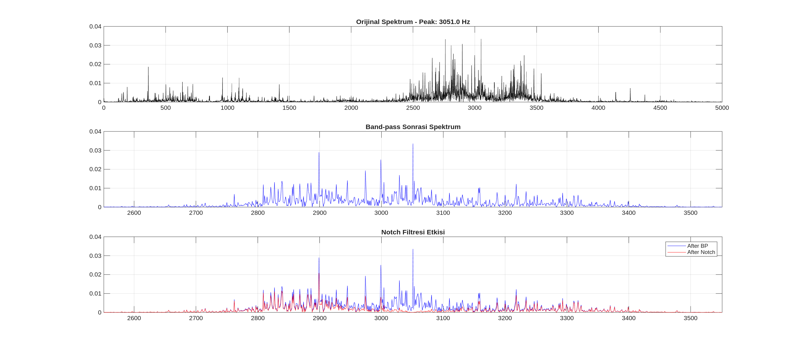

# Filtre Analizi ve Frekans Cevabı Temelleri

Sinyal işleme süreçlerinde sistemlerin karakterizasyonu ve girişe verilen tepkinin analizi, frekans alanı yöntemleriyle gerçekleştirilmektedir. Bu bölümde; filtre türleri, transfer fonksiyonu ($H(z)$) ile frekans cevabı ($H(e^{j\omega})$) arasındaki ilişki ve FIR/IIR filtre yapıları arasındaki temel farklar teknik bir perspektifle incelenmiştir.

---

### Filtre Kavramı ve Frekans Seçiciliği

Filtreleme işlemi, bir sistemin belirli frekans bileşenlerini geçirmesi ve diğerlerini bastırması olarak tanımlanmaktadır. Zaman alanında sinyalin formunu değiştiren bu işlem, frekans alanında sistemin giriş spektrumuyla ($X(e^{j\omega})$) frekans cevabının ($H(e^{j\omega})$) çarpımı olarak ifade edilir. Bu çarpım sonucunda çıkış spektrumu ($Y(e^{j\omega})$) elde edilir.

  

---

### Temel Filtre Türleri

Uygulama gereksinimlerine göre tercih edilen dört temel filtre tipi bulunmaktadır:

1.  **Low-Pass (Alçak Geçiren):** Düşük frekansları geçirir, yüksek frekansları bastırır. Sinyal yumuşatma (smoothing) işlemlerinde kullanılır.
2.  **High-Pass (Yüksek Geçiren):** Düşük frekansları bastırır, yüksek frekansları geçirir. DC ofset giderimi veya trend temizliğinde tercih edilir.
3.  **Band-Pass (Bant Geçiren):** Belirli bir frekans aralığını geçirir, diğer bölgeleri bastırır. İlgi duyulan belirli bir bandı izole etmek için kullanılır.
4.  **Notch (Çentik):** Çok dar bir frekans aralığını bastırmak için tasarlanır. Şebeke gürültüsü (50/60 Hz) gibi tekil girişimlerin temizlenmesinde etkilidir.

---

### Transfer Fonksiyonu ve Birim Çember

Dijital filtrelerin matematiksel modeli $H(z)$ transfer fonksiyonu ile tanımlanır. Sistemin frekans cevabı ($H(e^{j\omega})$), transfer fonksiyonunun kompleks Z-düzleminde birim çember üzerindeki değerlerine karşılık gelmektedir. Birim çember üzerinde yapılan her bir tam tur, $[0, 2\pi]$ radyanlık dijital frekans aralığını temsil eder.

---

### FIR ve IIR Filtre Yapıları

Sayısal filtreler, dürtü yanıtlarının süresine göre iki ana kategoriye ayrılmaktadır:

*   **FIR (Sonlu Dürtü Yanıtı):** Geri besleme içermeyen yapılardır. Her zaman kararlıdır ve lineer faz karakteristiği elde etmek daha kolaydır. Moving Average filtresi tipik bir FIR örneğidir.
*   **IIR (Sonsuz Dürtü Yanıtı):** Geri besleme içeren yapılardır. Daha az katsayıyla daha keskin frekans seçiciliği sağlayabilirler ancak kararlılık analizi kutup konumlarına göre dikkatle yapılmalıdır.

  

---

### Moving Average Filtresi Analizi

Moving Average (M-noktalı) filtresi, basit bir FIR low-pass yapısıdır. Filtre uzunluğu ($M$) arttıkça, frekans cevabındaki ana lob daralmakta ve bastırma etkisi (low-pass karakteri) şiddetlenmektedir. İlk sıfır frekansı yaklaşık olarak $f_0 \approx F_s / M$ noktasında oluşmaktadır.

  

---

### Gerçek Veri Uygulamaları

Teorik filtre yaklaşımları ses ve motor titreşim verileri üzerinde test edilmiştir.

*   **Ses Verisi:** Low-pass ve High-pass filtreler uygulanarak spektral değişimler gözlemlenmiştir.
*   **Motor Verisi:** Baskın bir frekans bileşeni tespit edildikten sonra, önce Band-pass ile ilgili bölge izole edilmiş, ardından Notch filtresiyle hedeflenen tepe noktası bastırılmıştır.

  
  

---

**Uygulama Notları:**
- Filtre tasarımı öncesinde spektrum analizi yapılarak hedef frekanslar belirlenmelidir.
- FIR filtreler (a=1) kararlılık avantajı sunarken, IIR filtreler (a vektörü birden fazla katsayı içerir) hesaplama verimliliği sağlar.
- Notch filtre tasarlanırken $r$ parametresi bastırma bandının daralmasını sağlar.
- Tüm filtreleme işlemlerinde sinyal başlangıcındaki geçici rejimin (transient) etkisi dikkate alınmalıdır.
