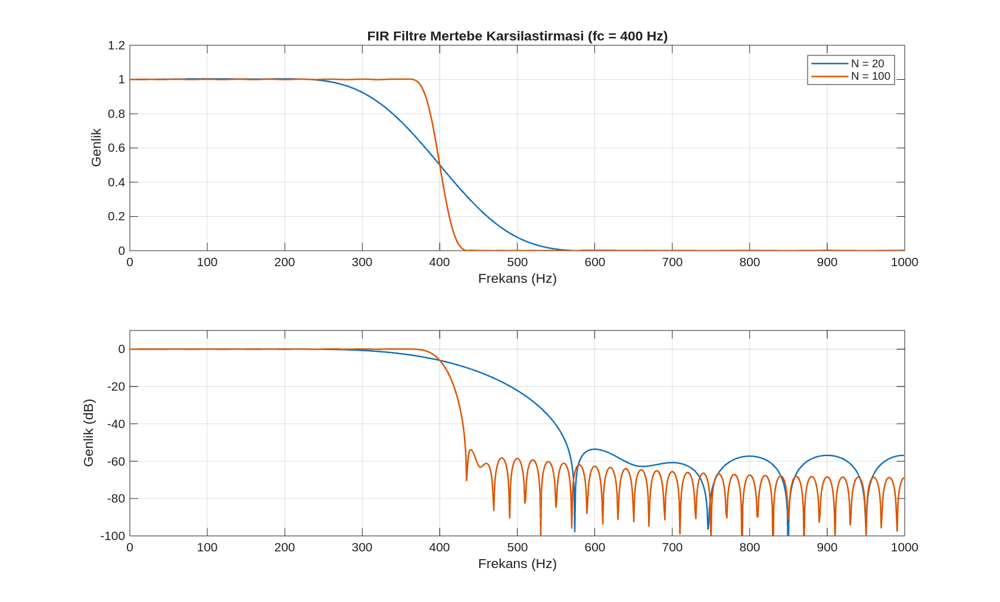
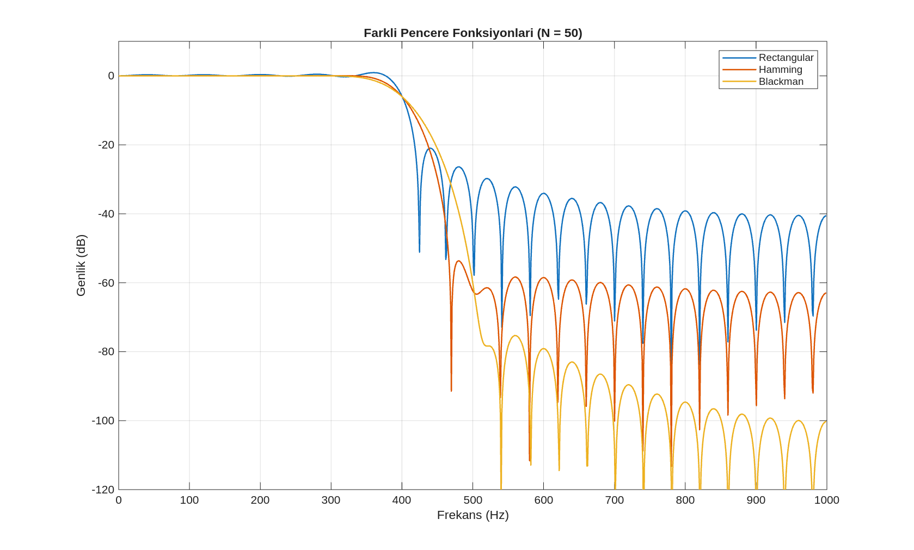
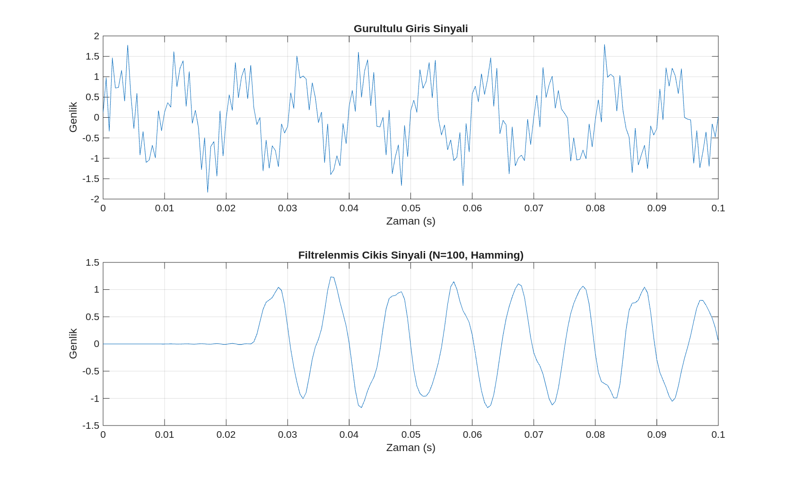

# FIR Filtre Tasarımı ve Pencereleme Yöntemleri (FIR Filter Design & Windowing Methods)

Sayısal sinyal işlemede sinyalleri gözlemleme aşamasından (FFT ve spektrum analizi), amaca yönelik müdahale aşamasına geçişin en önemli yapı taşlarından biri filtre tasarımıdır. Bu bölümde, belirli spektral kriterleri karşılayacak **Sonlu Dürtü Yanıtlı (FIR) filtrelerin pencereleme (windowing) yöntemi ile sıfırdan nasıl tasarlanacağı** ele alınmaktadır.

Mühendislik uygulamalarında çoğunlukla hazır bir filtre yapısı bulunmaz; bunun yerine çözülmesi gereken problem spektral sınırlarla tanımlanır. Örneğin, gürültülü bir sensör verisindeki yüksek frekanslı salınımları temizlemek, bir ses kaydındaki alçak frekanslı şebeke uğultusunu atmak veya döner makinelerden alınan titreşim verilerinde belirli bir arıza frekansı bandını izole etmek birer filtre tasarım problemidir. Bu bölümde, teorik bir hedef olan "ideal filtre" kavramından yola çıkarak, donanımlarda uygulanabilir sonlu ve nedensel FIR filtre katsayılarının nasıl üretildiği ve bu süreçteki mühendislik ödünleşimleri incelenmektedir.

---

## 1. Filtre Tasarımının Kelime Dağarcığı ve Spektral Bölgeler

Bir filtre tasarım problemini teknik olarak tanımlamak ve elde edilen sonuçları grafikler üzerinden doğru yorumlayabilmek için genlik cevabı ($magnitude \,\, response$) grafiği üzerinde beş temel kavram tanımlanır:

1.  **Passband (Geçirme Bandı):** Filtrenin hiçbir engelleme yapmadan geçirmesi, yani korunması istenen frekans aralığıdır. Bu bölgede filtrenin kazancı ideal olarak $1$ (veya lineer ölçekte $1$, desibel ölçeğinde $0\,\text{dB}$) civarındadır. Faydalı sinyal bileşenleri bu bantta korunur. Passband içinde izin verilen maksimum dalgalanma miktarına **Passband Ripple ($\delta_p$)** adı verilir.
2.  **Stopband (Durdurma Bandı):** Sinyalden tamamen temizlenmesi, bastırılması ve yok edilmesi istenen frekans aralığıdır. Bu bölgede filtrenin kazancı ideal olarak $0$'dır. Stopband içinde kalan kalıntı bileşenlerin maksimum genlik sınırına **Stopband Ripple ($\delta_s$)** denir.
3.  **Transition Band (Geçiş Bandı):** Passband ile stopband arasında kalan, filtrenin geçirme davranışından durdurma davranışına kademeli olarak düştüğü aralıktır. Geçiş bandı genişliği $\Delta f = f_s - f_p$ şeklinde hesaplanır (burada $f_p$ geçirme bandı sınırı, $f_s$ durdurma bandı başlangıcıdır). Gerçek fiziksel filtrelerde bu geçiş bölgesi sıfır genişlikte (ani bir duvar gibi) olamaz; mutlaka belirli bir frekans yayılımına sahiptir.
4.  **Cutoff Frequency (Kesim Frekansı - $f_c$):** Filtrenin geçirme karakteristiğinden zayıflatma karakteristiğine geçtiği eşik frekanstır. İdeal filtrelerde tek bir kesim noktası yeterliyken, geçiş bandına sahip gerçek filtrelerde cutoff frekansı genellikle kazancın en yüksek değerinden $-3\,\text{dB}$ (yani genliğin $1/\sqrt{2} \approx 0.707$ seviyesine) düştüğü orta nokta olarak tanımlanır.
5.  **Attenuation (Stopband Zayıflatması):** İstenmeyen frekans bileşenlerinin filtre tarafından ne kadar güçlü biçimde bastırıldığını ifade eden ölçüdür. Genellikle desibel ölçeğinde (örn. $-40\,\text{dB}$, $-60\,\text{dB}$) ifade edilir. Zayıflatma miktarı ne kadar yüksekse, durdurma bandındaki gürültüler o kadar etkili temizlenir.

---

## 2. İdeal Filtre Paradoksu ve Gerçeklenebilirlik Sınırları

Tasarım hedefleri belirlenirken teorik olarak ele alınan "ideal alçak geçiren filtre", kesim frekansına ($f_c$) kadar kazancı tam olarak $1$ olan, kesim frekansından sonra ise aniden $0$'a inen dik bir duvar şeklindedir. Bu ideal filtrenin frekans alanı tanımı şu şekildedir:

$$H_{\text{ideal}}(e^{j\omega}) = \begin{cases} 1, & |\omega| \le \omega_c \\ 0, & \omega_c < |\omega| \le \pi \end{cases}$$

Frekans alanındaki bu dik duvar karakteristiğinin zaman alanındaki karşılığını bulmak için **Ters Sürekli Zamanlı Fourier Dönüşümü (IDFT)** uygulanır. Elde edilen zaman alanı dürtü yanıtı ($impulse \,\, response$) sonsuza uzayan bir $\text{sinc}$ fonksiyonudur:

$$h_{\text{ideal}}[n] = \frac{1}{2\pi} \int_{-\omega_c}^{\omega_c} 1 \cdot e^{j\omega n} d\omega = \frac{\sin(\omega_c n)}{\pi n} = 2 f_c \cdot \text{sinc}(2 f_c n)$$

Bu matematiksel sonuç, ideal bir filtrenin sayısal işlemcilerde ve donanımlarda **doğrudan neden kodlanıp çalıştırılamayacağını** iki fiziksel kısıtla açıklar:

1.  **Sonsuz Katsayı Kısıtı (Sonsuz Bellek ve İşlem İhtiyacı):** Sinc fonksiyonunun kuyrukları $-\infty$ ile $+\infty$ arasında sönümlenerek sonsuza kadar uzanır. Bilgisayar belleğinde sonsuz sayıda katsayıyı ($h_{\text{ideal}}[n]$) saklamak ve konvolüsyon işleminde sonsuz çarpım-toplam yapmak imkansızdır. FIR filtreler doğası gereği "Sonlu" ($Finite$) dürtü yanıtına sahip olmak zorundadır.
2.  **Nedensizlik (Non-Causality) Problemi:** Grafikte de görüleceği üzere, sinc fonksiyonu $n < 0$ (geçmiş zaman) bölgelerinde de sıfırdan farklı değerlere sahiptir. Nedensel bir sistemin çalışabilmesi için katsayılarının $n < 0$ için sıfır olması gerekir. İdeal bir filtre, $n=0$ anındaki bir girişe cevap verebilmek için gelecekteki sonsuz sayıdaki örneğe ihtiyaç duyar; bu da gerçek zamanlı bir sistemde zamansal olarak imkansızdır.

Bu nedenle, filtre tasarımı aslında mükemmel idealliği birebir üretmek değil; **uygulanabilir, sonlu uzunlukta ve nedensel bir filtre yapısıyla ideal hedef cevaba mümkün olduğunca yaklaşma (yaklaşıklık - approximation) mühendisliğidir.** Bu sonlu uzunluk kısıtının doğal ve kaçınılmaz bir sonucu olarak gerçek filtrelerde transition band (geçiş bandı) doğar.

---

## 3. Pencereleme Yönteminin (Window Method) Çalışma İlkesi

Sonsuza uzayan ideal dürtü yanıtını ($h_{\text{ideal}}[n]$) sonlu ve uygulanabilir bir FIR filtre katsayı dizisine dönüştürmenin en pratik yolu, bu sonsuz seriyi merkezden itibaren belirli bir $N$ mertebesinde (kesim sınırında) kesip atmaktır. Matematiksel olarak bu işlem, zaman alanında ideal dürtü yanıtının sonlu bir **pencere fonksiyonu** ($w[n]$) ile çarpılmasıyla gerçekleştirilir:

$$h[n] = h_{\text{ideal}}[n] \cdot w[n]$$

Burada $h[n]$, tasarlanan gerçek filtrenin sonlu katsayı dizisidir. Zaman alanında yapılan bu çarpma işleminin frekans alanındaki karşılığı, ideal dik duvar spektrumu ile pencere fonksiyonunun spektrumunun **periyodik konvolüsyonudur**:

$$H(e^{j\omega}) = \frac{1}{2\pi} H_{\text{ideal}}(e^{j\omega}) * W(e^{j\omega})$$

Pencere fonksiyonunun spektrumundaki köşeli hatların yuvarlanması, frekans cevabında dik duvarın eğilmesine (geçiş bandı oluşmasına) ve kesim noktaları civarında **dalgalanmalara (Gibbs Olgusu)** yol açar. İdeal dürtü yanıtı zaman alanında ne kadar sert kesilirse, frekans alanındaki dalgalanmalar o kadar belirgin kalır.

---

## 4. Mühendislik Ödünleşimleri: Mertebe ve Geçiş Bandı İlişkisi

FIR filtre tasarım sürecinde parametreler arasında doğrudan bir "bedelsiz kazanç yoktur" dengesi ($trade-off$) hakimdir. Filtre katsayı sayısı $M = N + 1$ olarak tanımlanır (burada $N$ filtre mertebesidir).

*   **Mertebe ($N$) Artırılmasının Etkisi:** Mertebe artırıldığında zaman alanındaki pencere genişler. Bu durum, ideal sinc fonksiyonunun kuyruklarındaki daha fazla terimin korunması ve filtre katsayılarına dahil edilmesi anlamına gelir. Zaman alanında daha geniş bilgi tutulduğu için, frekans alanındaki geçiş bandı ($\text{transition \,\, band}$) belirgin biçimde daralır ve filtre dik duvara daha çok yaklaşır.
*   **Maliyet Bedeli:** Mertebenin artması filtrenin keskinliğini iyileştirirken; konvolüsyon işlemindeki çarpma-toplama sayısını (hesap yükü), katsayıların saklanacağı hafıza miktarını ve en önemlisi filtre içindeki **grup gecikmesini ($group \,\, delay = N/2 \,\, örnek$)** doğrusal olarak artırır.

Geçiş bandı genişliği ($\Delta f$) ile filtre mertebesi ($N$) arasındaki pratik mühendislik bağıntısı şu formülle ifade edilir:

$$N \approx \frac{k \cdot F_s}{\Delta f}$$

Burada $F_s$ örnekleme frekansı (Hz), $\Delta f$ Hz cinsinden hedef geçiş bandı genişliği ($f_s - f_p$) ve $k$ ise seçilen pencere türünün matematiksel yapısına bağlı olarak değişen bir keskinlik sabitidir.

  
   
  <em>Görsel 1: Aynı kesim frekansı ($f_c = 400\,\text{Hz}$) ve örnekleme frekansı ($F_s = 2000\,\text{Hz}$) altında tasarlanan düşük mertebeli ($N = 20$) ve yüksek mertebeli ($N = 100$) FIR filtrelerin genlik cevaplarının karşılaştırılması. Üstteki grafik lineer genlik ölçeğinde, alttaki ise desibel (dB) ölçeğindedir. $N = 20$ (mavi eğri) tasarımında geçirme bandından durdurma bandına geçişin çok yayvan (geniş geçiş bandı) ve durdurma bandı zayıflatmasının yetersiz olduğu görülmektedir. Mertebe $N = 100$'e çıkarıldığında (kırmızı eğri) geçiş bandının son derece daraldığı, filtrenin keskinleştiği ve stopband bölgesindeki bastırma kalitesinin arttığı netçe gözlemlenmektedir.</em>

---

## 5. Pencere Fonksiyonu Türleri ve Spektral Karakteristikleri

Zaman alanında ideal dürtü yanıtını kesmek için kullanılan pencerelerin kenar şekilleri (dik veya yumuşatılmış sönümlü olmaları), frekans alanındaki sonucu doğrudan belirler. Bir pencerenin spektral başarısı iki kritere göre ölçülür:
*   **Ana Lob Genişliği ($Main \,\, Lobe \,\, Width$):** Filtrenin geçiş bandının genişliğini belirler. Ana lob ne kadar darsa, geçiş o kadar keskindir.
*   **Yan Lob Seviyesi ($Side \,\, Lobe \,\, Level$):** Filtrenin stopband bölgesindeki sızıntı ve dalgalanma miktarını belirler. Yan loblar ne kadar düşükse, stopband zayıflatması o kadar başarılıdır.

Aşağıda endüstride ve eğitimde kullanılan temel pencere tipleri teorik özellikleriyle kıyaslanmıştır:

### 1. Rectangular Window (Dikdörtgen Pencere)
Zaman alanında katsayıları belirli bir aralıkta doğrudan $1$ ile çarpar, dışarıyı sıfırlar. Zaman alanında en sert kesimi yaptığı için frekans alanında en dar ana lob genişliğini ($\frac{4\pi}{N+1}$) yani **en keskin geçiş bandını** sunar. Ancak sönümleme yapmadığı için yan lob seviyesi yalnızca $-13\,\text{dB}$'de kalır. Bu durum, durdurma bandında çok yüksek gürültü sızıntılarına ve Gibbs olgusu dalgalanmalarına yol açar. Keskin geçiş sunmasına rağmen pratik filtrelemede başarısı düşüktür.

### 2. Hann Window (Hanning)
Zaman alanında bir kosinüs eğrisi formunda kenarlara doğru tamamen sıfıra inen yumuşak bir sönümleme yapar. Bu yumuşak geçiş sayesinde frekans alanındaki yan lob seviyesini $-44\,\text{dB}$ düzeyine indirerek durdurma bandını pürüzsüzleştirir. Ancak bu başarının bedeli olarak ana lob genişliği iki katına ($\frac{8\pi}{N+1}$) çıkar; yani geçiş bandı rectangular pencereye göre iki kat genişler.

### 3. Hamming Window
Hann penceresine çok benzer ancak zaman alanında kenarlara indiğinde tam sıfıra düşmeyip küçük bir taban seviyesi ($0.08$) bırakır. Bu optimizasyon, en yakın yan lob seviyesini $-43\,\text{dB}$'de tutarken, genel yan lob sönümleme hızını dengeler. Geçiş bandı genişliği ($\frac{8\pi}{N+1}$) ile sızıntı bastırma performansı arasında mükemmel bir endüstriyel uzlaşma sunduğu için pratik FIR tasarımlarında standart başlangıç penceresi kabul edilir.

### 4. Blackman Window
Zaman alanında kenarlara doğru Hann ve Hamming'e göre çok daha agresif ve kademeli bir sönümleme profili sergiler. Bu sayede frekans alanındaki yan lob seviyesini $-74\,\text{dB}$ gibi olağanüstü bir bastırma kalitesine ulaştırır; durdurma bandındaki gürültüler tamamen yok edilir. Ancak mühendislik dengesi gereği ana lob genişliği en yüksek seviyeye ($\frac{12\pi}{N+1}$) ulaşır; yani geçiş bandı en geniş olan penceredir. Çok yüksek stopband attenuation gerektiren hassas ölçüm cihazlarında tercih edilir.

  
   
  <em>Görsel 2: Aynı mertebede ($N = 50$) tasarlanan Rectangular (mavi), Hamming (yeşil) ve Blackman (kırmızı) pencereli FIR filtrelerin desibel (dB) ölçeğindeki genlik cevaplarının karşılaştırılması. Grafik, pencerelerin mühendislik ödünleşimini sayısal olarak kanıtlar: Rectangular pencere (mavi) $-3\,\text{dB}$ civarında en dar düşüşü (en keskin geçişi) yapmasına rağmen, stopband bölgesinde yan lob dalgalanmaları $-13\,\text{dB}$ seviyesinde kalarak büyük sızıntı yapmaktadır. Blackman penceresi (kırmızı) ise $-74\,\text{dB}$'ye kadar mükemmel bir bastırma derinliğine ulaşırken, geçiş bandının (düşüş eğiminin) en yayvan ve geniş olduğunu açıkça göstermektedir.</em>

---

## 6. MATLAB ile fir1 Fonksiyonu ve Sayısal Tasarım Akışı

MATLAB ortamında pencere tabanlı FIR filtre katsayılarını ($b$ katsayı vektörünü) üretmek için endüstri standardı olan `fir1` fonksiyonu kullanılır. Bu fonksiyon arka planda ideal sinc katsayılarını üretip seçilen pencere fonksiyonuyla çarpar.

### Normalize Frekans Hesaplama İlkesi
`fir1` fonksiyonu kesim frekansını doğrudan Hz cinsinden kabul etmez. Sayısal frekans eksenine uyum sağlamak amacıyla, hedef Hz değeri sistemin en yüksek işleyebileceği frekans olan Nyquist sınırına ($F_s / 2$) bölünerek $[0, \, 1]$ aralığına sıkıştırılır:

$$W_n = \frac{f_c}{F_s / 2}$$

**Sayısal Örnek Hesaplama:** $F_s = 8000\,\text{Hz}$ örnekleme frekansına sahip bir sistemde, $f_c = 1000\,\text{Hz}$ kesim frekansına sahip bir alçak geçiren filtre tasarlanmak istendiğinde fonksiyona girilecek normalize kesim frekansı:
$$W_n = \frac{1000}{8000 / 2} = \frac{1000}{4000} = 0.25$$
olarak hesaplanır.

### Kod Sözdizimi Yapıları ve Filtre Tipleri:
*   **Alçak Geçiren (Low-Pass):** `b = fir1(N, Wn, 'low')` -> $W_n$ normalize frekansının altındaki bileşenleri geçirir, üstünü bastırır.
*   **Yüksek Geçiren (High-Pass):** `b = fir1(N, Wn, 'high')` -> $W_n$ normalize frekansının altındaki bileşenleri zayıflatır, üstünü geçirir.
*   **Bant Geçiren (Band-Pass):** `b = fir1(N, [Wn1 Wn2], 'bandpass')` -> $W_{n1}$ ile $W_{n2}$ normalize frekansları arasında kalan bölgeyi geçirir, altını ve üstünü bastırır. İki elemanlı bir aralık dizisi alır.

---

## 7. Gerçek Veri Üzerinde Uygulamalar ve Spektral Müdahale

### 7.1. Ses Verisi Üzerinde FIR Filtreleme Keşifleri
Ses sinyalleri, tasarlanan FIR filtrelerin etkilerinin hem spektrum grafiğinde görülmesini hem de kulakla işitsel olarak algılanmasını sağlayan araçlardır. `surprised.wav` ses dosyası üzerinde yapılan filtreleme deneyleri şu algısal ve teknik sonuçları üretir:
*   **Low-Pass Deneyimi:** Sese $f_c = 1500\,\text{Hz}$ kesimli bir low-pass uygulandığında, konuşmadaki "s, ş, t" gibi yüksek frekanslı sert ünsüz harfler ve parlaklık zayıflar. Ses algısal olarak boğuk, uzaktan geliyormuş gibi ya da "boğulmuş" bir karakter kazanır. Spektrumda üst frekans bölgesinin zayıfladığı doğrulanır.
*   **High-Pass Deneyimi:** Sese $f_c = 300\,\text{Hz}$ kesimli bir high-pass uygulandığında, mikrofondan veya ortamdan gelen alçak frekanslı masa titreşimleri ve bas uğultular tamamen temizlenir. Ancak konuşmanın temel gövdesini oluşturan kalın ses bileşenleri de yok olduğu için ses algısal olarak incelir, teneke kutudan geliyormuş gibi telsi ve tiz bir karakter kazanır.
*   **Band-Pass Keşifleri:** Konuşmanın insan kulağı tarafından en anlaşılır olduğu orta bant ($800 - 2000\,\text{Hz}$) yalıtılarak gürültülü ortamlarda sesin nasıl netleştirilebileceği test edilir.

### 7.2. CWRU Motor Titreşim Verisi Üzerinde Veri Güdümlü Tasarım
Endüstriyel makinelerin rulman ve dişli arıza analizlerinde filtre parametreleri tahmini olarak seçilmez; tamamen **veri güdümlü (data-driven)** bir iş akışıyla belirlenir. Case Western Reserve University (CWRU) rulman veri setindeki ($B007\_1\_123.mat$, Drive End arıza kanalı `X123_DE_time`, $F_s = 48000\,\text{Hz}$) titreşim sinyali üzerinde şu adımlar izlenir:

1.  **Ön İşleme ve DC Temizliği:** Analiz edilecek 1 saniyelik segment sinyalinden ortalama değer çıkarılarak ($x = x - \text{mean}(x)$) 0 Hz (DC) noktasındaki yapay baskınlık temizlenir.
2.  **FFT Spektrum Analizi:** Sinyalin tek taraflı genlik spektrumu çizilir. Spektrum incelendiğinde, rulmandaki bilye hasarının mekanik yapıları tetiklemesi sonucu ortaya çıkan en baskın rezonans tepe noktası ($peak$) frekansı okunur. Bu tepe noktası $\approx 3051\,\text{Hz}$ civarında keskin bir çizgi olarak kendini gösterir.
3.  **FIR Filtre Tasarım Kararı:** Tüm sinyalin değil, rulman arızasının imzasını taşıyan bu rezonans bölgesinin izole edilmesi amaçlandığı için bu peak frekansı merkez kabul edilerek etrafında $\pm 500\,\text{Hz}$ genişliğinde bir aralık ($2551\,\text{Hz} - 3551\,\text{Hz}$) belirlenir.
4.  **Katsayı Üretimi:** Belirlenen bu Hz sınırları Nyquist frekansına ($24000\,\text{Hz}$) bölünerek normalize edilir ve `fir1(120, [Wn1 Wn2], 'bandpass')` komutuyla 120. mertebeden Hamming pencereli bir FIR bant geçiren filtre tasarlanır.
5.  **Doğrulama:** Filtre katsayıları sinyale uygulandıktan sonra elde edilen çıkış spektrumu orijinal spektrumla üst üste bindirilir. Arıza bandının başarıyla izole edildiği, motorun dönme frekansından kaynaklanan düşük frekanslı alakasız büyük salınımların ve yüksek frekanslı beyaz gürültü tabanının başarıyla zayıflatıldığı grafik üzerinden sayısal olarak ispatlanır.

  
   
  <em>Görsel 3: Tasarlanan FIR alçak geçiren filtrenin yüksek frekanslı gürültüler içeren gerçek bir zaman serisi sinyali üzerindeki uygulamasının analizi. Üstteki grafik gürültülü orijinal giriş sinyalini, alttaki grafik ise filtrelenmiş temiz çıkışı göstermektedir. Çıkış sinyalinde gürültü salınımları başarıyla sönümlenmiş ve ana dalga formu pürüzsüzleştirilmiştir. Burada en kritik mühendislik gözlemi **filtrenin geçici rejim (transient) davranışıdır**. Filtre katsayılarının veri hattını doldurması sürecinde, grafiğin en sol başlangıç kısmında yaklaşık $N/2$ örnek genişliğinde yapay bir başlangıç salınımı (transient süresi) oluşmaktadır. Aynı şekilde filtrelenmiş sinyal, orijinal sinyale göre zaman ekseninde tam olarak $N/2$ örnek kadar sağa kaymıştır; bu durum FIR filtrelerin doğasındaki **sabit grup gecikmesinin ($group \,\, delay$)** zaman alanındaki doğrudan görsel kanıtıdır.</em>

---
