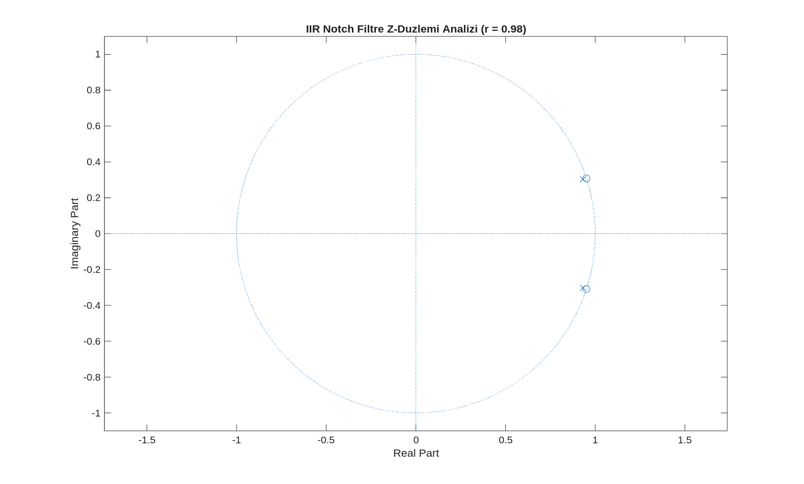
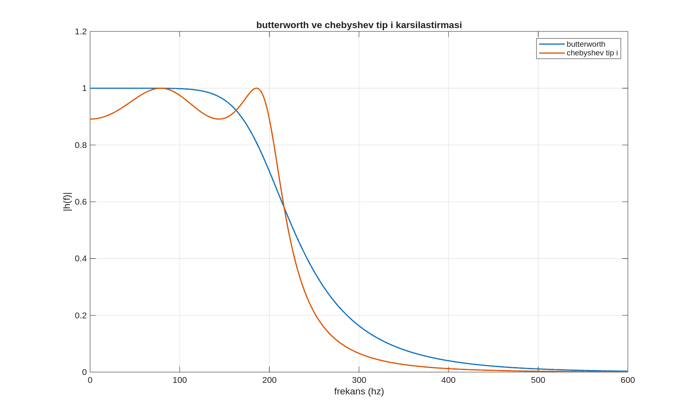
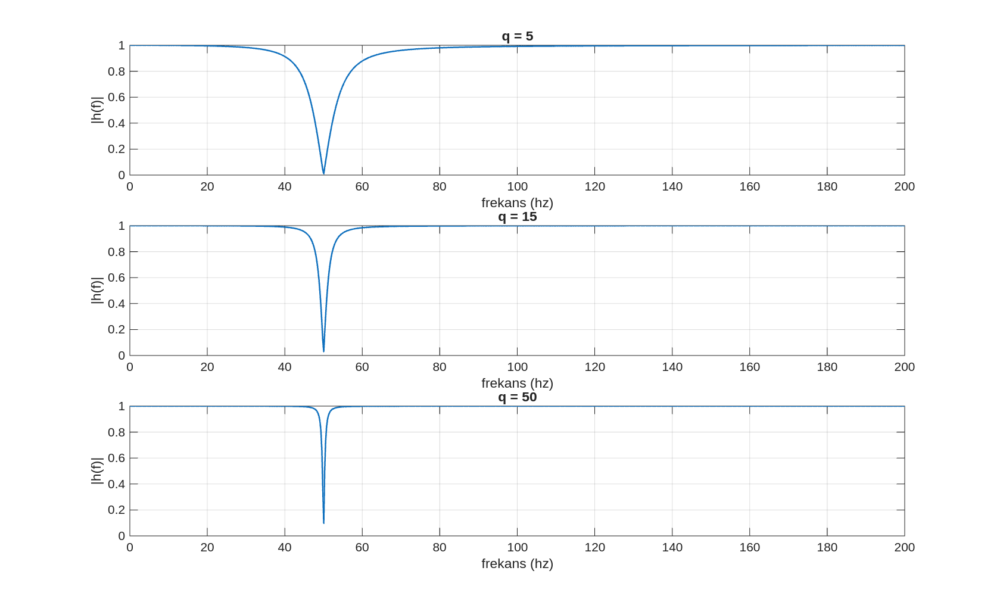

# Sonsuz Dürtü Yanıtlı (IIR) Filtre Tasarımı ve Kararlılık Temelleri

Sayısal sinyal işlemede ileri beslemeli (FIR) yapılardan, çıkış sinyalinin geçmiş değerlerini de sürece dahil eden **geri beslemeli (feedback) Sonsuz Dürtü Yanıtlı (IIR) filtrelere** geçiş ve bu yapıların tasarım temelleri bu bölümde ele alınmaktadır.

Mühendislik tasarımlarında temel amaç, belirli frekans bileşenlerini keskin bir şekilde ayırt edebilmek ve bunu yaparken hesaplama maliyetini, bellek gereksinimlerini ve grup gecikmesini minimumda tutmaktır. FIR filtreler doğrusal faz ve mutlak kararlılık avantajı sunarken, keskin geçiş bandı gereksinimlerinde çok yüksek mertebelere ($N \gg 100$) ihtiyaç duyarlar. IIR filtreler ise yapılarındaki geri besleme mekanizması sayesinde, **çok daha düşük mertebelerle (daha az katsayı kullanarak) son derece keskin frekans seçiciliği** sağlayabilirler. Ancak bu yüksek verimlilik, sistemin kontrolsüz şekilde salınım yapması veya sınırsız çıkış üretmesi riskini, yani **kararlılık (stability)** problemini beraberinde getirir. Dolayısıyla IIR filtre mühendisliği, yüksek performans ile kararlılık sınırları arasında bilinçli bir denge kurma sürecidir.

---

## 1. IIR Filtrelerin Matematiksel Altyapısı ve Geri Besleme Mekanizması

FIR filtre yapılarında sistem çıkışı yalnızca giriş sinyalinin şimdiki ve geçmiş değerlerine bağlıyken, bir IIR filtrede sistem kendi geçmiş çıktılarını bir döngü halinde sisteme geri besler.

### 1.1. Genel Fark Denklemi (Difference Equation)
LTI (Lineer Zamanla Değişmeyen) bir IIR filtrenin zaman alanındaki genel giriş-çıkış ilişkisi şu fark denklemi ile tanımlanır:

$$y[n] = \sum_{k=0}^{M} b_k x[n-k] - \sum_{m=1}^{P} a_m y[n-m]$$

Bu denklemde terimlerin fiziksel anlamları şunlardır:
*   $x[n-k]$: Giriş sinyalinin şimdiki ve $k$ örnek kadar gecikmiş değerleridir.
*   $y[n-m]$: Filtre çıkış sinyalinin $m$ örnek kadar geçmiş (gecikmiş) değerleridir.
*   $b_k$: Sistemi besleyen **ileri besleme (forward path)** katsayılarıdır (numerator).
*   $a_m$: Çıkışı tekrar toplama noktasına döndüren **geri besleme (feedback path)** katsayılarıdır (denominator). Geri besleme katsayılarının varlığı, sistemin dürtü yanıtının ($impulse \,\, response$) teorik olarak sonsuza kadar uzanmasının ($Infinite$) doğrudan nedenidir.

### 1.2. Blok Diyagram Yapısı
En basit haliyle birinci dereceden bir geri beslemeli IIR sistemin ($y[n] = b_0 x[n] + a_1 y[n-1]$) blok diyagram mimarisi, çıkıştan girişe uzanan gecikmeli halkayı açıkça ortaya koyar. İleri besleme yolu girişi ölçeklerken, geri besleme yolu çıkış sinyalini bir örnek geciktirip ($z^{-1}$) $a_1$ katsayısıyla çarparak ana toplama noktasına enjekte eder.

---

## 2. Z-Düzleminde Kutup (Pole) Konumları ve Kararlılık Analizi

Bir IIR filtrenin frekans domeni davranışı, zaman domeni sönümleme hızı ve kararlılığı, transfer fonksiyonunun $Z$-düzlemindeki **kutupların ($poles$) konumuna** bağlıdır. Transfer fonksiyonunun genel formu:

$$H(z) = \frac{Y(z)}{X(z)} = \frac{\sum_{k=0}^{M} b_k z^{-k}}{1 + \sum_{m=1}^{P} a_m z^{-m}}$$

Sistemin payını sıfır yapan noktalara **Sıfırlar ($zeros$)**, paydayı sıfır (transfer fonksiyonunu sonsuz) yapan noktalara ise **Kutuplar ($poles$)** denir.

### 2.1. BIBO Kararlılık Kriteri (Bounded-Input Bounded-Output)
Bir sayısal filtrenin fiziksel olarak donanımlarda güvenle çalışabilmesi için sınırlı bir giriş işareti uygulandığında daima sınırlı bir çıkış işareti üretmesi (BIBO kararlılık kuralı) gerekir. Nedensel bir IIR filtrenin kararlı olabilmesi için temel ve mutlak kural şudur:

$$\text{Tüm kutuplar Z-düzleminde yarıçapı 1 olan birim çemberin kesinlikle İÇİNDE yer almalıdır: } |p_m| < 1$$

### 2.2. Kutup Yarıçapının ($r$) Matematiksel ve Sezgisel İncelemesi
Basit birinci dereceden $y[n] = x[n] + a \cdot y[n-1]$ sistemini ele alalım. Bu sistemin kutup noktası doğrudan $z = a$ konumundadır. Sisteme zaman alanında bir birim dürtü sinyali ($\delta[n]$) uygulandığında sistemin ürettiği dürtü yanıtı serisi şu geometrik dizi halini alır:

$$h[n] = [1, \,\, a, \,\, a^2, \,\, a^3, \,\, \dots, \,\, a^n]$$

Bu serinin $n \to \infty$ durumundaki sönümleme ve kararlılık davranışı tamamen kutup yarıçapı olan $|a|$ değerine bağlıdır:
1.  $|a| < 1$ (Birim Çemberin İçi): Katsayının kuvvetleri alındıkça terimlerin genliği zamanla küçülür, dürtü yanıtı sıfıra doğru sönümlenir. Sistem kararlıdır. Kutup birim çembere ne kadar yakınsa ($a \to 1$), sönümlenme o kadar yavaş olur ve sistem geçmişi o kadar uzun süre hafızasında taşır.
2.  $|a| = 1$ (Birim Çember Üzeri): Sönümlenme gerçekleşmez; sistem sürekli olarak aynı genlikte salınım yapar veya kararlılık sınırında kalır.
3.  $|a| > 1$ (Birim Çemberin Dışı): Terimlerin genliği geometrik olarak büyür, $n \to \infty$ durumunda çıkış sonsuza gider. Sistem kararsızdır ($unstable$). Donanımlarda bu durum taşmaya ($overflow$) ve sistemin kilitlenmesine yol açar.

<p align="center">
  
  <br>
  <em>Görsel 1: Tasarlanan bir IIR notch (çentik) filtresinin Z-düzlemindeki kutup-sıfır diyagramı analizi. Genlik cevabında tamamen sıfırlanması hedeflenen frekans açısına karşılık gelen noktada sıfır çifti ($o$) tam birim çember $|z|=1$ çizgisi üzerine yerleştirilmiştir. Filtrenin bu sıfırlama noktası dışında kalan çevre frekansları bozmaması (dar bantlı olması) için, aynı açı doğrultusunda birim çemberin hemen içerisine ($r = 0.95$ veya $r = 0.98$) bir kutup çifti ($\times$) konumlandırılmıştır. Kutupların birim çember sınırının içinde kalması sistemin BIBO kararlı olduğunun doğrudan geometrik ispatıdır.</em>
</p>

---

## 3. IIR Filtre Tasarım Standartları: Butterworth ve Chebyshev Karşılaştırması

Sayısal filtre tasarım teorisinde, ideal dik duvar süzme karakteristiğine yaklaşabilmek amacıyla farklı matematiksel optimizasyon kriterlerine dayanan filtre aileleri geliştirilmiştir:

### 3.1. Butterworth Filtre Karakteristiği
Butterworth filtrelerinin temel tasarım felsefesi, geçirme bandı ($passband$) içindeki kazancın mükemmel bir düzlük sergilemesidir. Literatürde **maksimum düz genlik cevabı ($maximally \,\, flat$)** olarak bilinir.
*   **Avantajları:** Geçirme bandı içinde hiçbir dalgalanma ($ripple$) barındırmaz, sinyal bileşenlerinin genlik yapısını bozmadan pürüzsüzce geçirir.
*   **Dezavantajları:** Geçirme bandından durdurma bandına geçiş eğimi (keskinliği) Chebyshev filtrelere kıyasla daha yayvandır. Aynı sertlikte bir düşüş elde etmek için daha yüksek filtre mertebesine ihtiyaç duyar.

### 3.2. Chebyshev Filtre Karakteristiği
Chebyshev filtreleri, geçiş bandı keskinliğini maksimum düzeye çıkarmak (daha dar transition band elde etmek) amacıyla tasarlanmıştır. Bu agresif keskinlik başarısının bedeli olarak, frekans cevabının belirli bölgelerinde kontrollü **dalgalanmalara ($ripple$)** izin verilir.
*   **Chebyshev Type I:** Geçirme bandında ($passband$) dalgalanmalar yer alırken, durdurma bandı ($stopband$) tamamen monoton ve düz bir sönümleme gösterir.
*   **Chebyshev Type II:** Geçirme bandı tamamen düz ve monotondur; ancak durdurma bandında dalgalanmalar ($ripple$) yer alır.

### 3.3. Kritik Mühendislik Dengesi
Aynı filtre mertebesi ($N$) altında bu iki aile kıyaslandığında; Chebyshev filtre çok daha dik ve dar bir geçiş bandı sunarak seçicilik performansında Butterworth'ü geride bırakır. Mühendislik kararı verilirken **"mükemmel genlik düzgünlüğü mü"** yoksa **"maksimum geçiş keskinliği mi"** istendiği belirlenerek aile seçimi yapılır.

<p align="center">
  
  <br>
  <em>Görsel 2: Aynı kesim kriterleri altında tasarlanan bir FIR filtre (ileri beslemeli hareketli ortalama) ile düşük mertebeli geri beslemeli bir IIR filtrenin dört temel grafikte karşılaştırmalı analizi. Birinci grafik zaman alanı çıkışlarındaki yerleşme farkını, ikinci grafik dürtü yanıtını ($h[n]$) gösterir. FIR filtrenin dürtü yanıtının belirli bir örnek sonra bıçak gibi kesilerek sıfıra ulaştığı (sonlu yapı), IIR filtrenin dürtü yanıtının ise geri besleme döngüsü nedeniyle azalarak sonsuza uzadığı netçe görülmektedir. Üçüncü grafik frekans cevabında IIR yapının çok daha az katsayıyla nasıl daha keskin bir diklik ürettiğini ispatlar; alt grafik ise giriş-çıkış spektrum doğrulamasıdır.</em>
</p>

---

## 4. Özel Amaçlı Dar Bant Bastırma: IIR Notch (Çentik) Filtre Teorisi

Gerçek zamanlı sinyal toplama işlemlerinde en sık karşılaşılan bozucu gürültü türü, ölçüm yapılan ortamdaki elektrik kablolarından sızan **50 Hz veya 60 Hz şebeke girişimidir ($power-line \,\, interference$)**. Bu gürültü sinyale geniş bir bantta yayılmaz; spektrumda tam 50 Hz frekansında keskin bir parazit çizgisi (saf sinüs gürültüsü) olarak eklenir. Genel amaçlı alçak geçiren filtreler kullanmak gürültüyü silerken gürültünün üstündeki tüm faydalı yüksek frekans bileşenlerini de yok eder. Çözüm, yalnızca hedef frekansı yok eden ve çevre frekansları tamamen koruyan **IIR Notch (Çentik) Filtre** yapısıdır.

### 4.1. Notch Katsayılarının Doğrudan Kutup-Sıfır Tasarımı
İkinci mertebeden pratik bir dijital IIR notch transfer fonksiyonunun matematiksel formu şu şekildedir:

$$H(z) = \frac{1 - 2\cos(\omega_0)z^{-1} + z^{-2}}{1 - 2r\cos(\omega_0)z^{-1} + r^2 z^{-2}}$$

Bu denklemdeki parametrelerin sayısal analizi filtre karakteristiğini doğrudan belirler:
*   **$\omega_0$ (Merkez Açısal Frekans):** Bastırılmak istenen parazit frekansının ($f_0$ Hz) radyan/örnek cinsinden dijital karşılığıdır. Örnekleme frekansı $F_s$ olmak üzere şu dönüşümle hesaplanır:
    $$\omega_0 = 2\pi \frac{f_0}{F_s}$$
    Pay kısmında yer alan kosinüslü ifade, tam olarak $z = e^{\pm j\omega_0}$ birim çember üzerindeki noktalara birer sıfır ($zero$) çifti yerleştirir. Bu sayede $\omega_0$ frekansındaki sinyal bileşeni sıfır ile çarpılarak tamamen yok edilir.
*   **$r$ (Kutup Yarıçapı):** Paydadaki sönüm katsayısıdır ve aynı açı doğrultusundaki kutup çiftinin merkeze olan uzaklığını ($0 < r < 1$) belirler. $r$ parametresi, notch filtresinin kalitesini ve seçiciliğini belirleyen en kritik parametredir.

### 4.2. Kalite Faktörü ($Q$) ve Notch Genişliği Dengesi
Notch filtresinin ne kadar dar bir bantta çalışacağı endüstride **Kalite Faktörü ($Q$)** ile tanımlanır. İlişki şu şekildedir:

$$Q = \frac{f_0}{BW}$$

Burada $BW$, filtrenin gücünün yarıya düştüğü ($-3\,\text{dB}$) çentik genişliğidir. Tasarımda kutup yarıçapı $r$, hedef $Q$ veya bant genişliği kriterine göre doğrudan şu yaklaşıklıkla seçilir:

$$r \approx 1 - \frac{BW}{F_s} \pi$$

*   **Büyük $Q$ ($r \to 1$ durumu, örn. $r = 0.99$):** Kutuplar birim çember üzerindeki sıfır noktasına geometrik olarak çok yakınlaşır. Bunun frekans alanındaki sonucu, notch bandının son derece daralması ve keskinleşmesidir. Filtre tam olarak 50 Hz'i silerken, 49 Hz ve 51 Hz'deki faydalı bileşenlere neredeyse hiç dokunmaz. Ancak kutuplar çembere çok yakın olduğu için sistemin zaman alanındaki hafızası uzar, **geçici rejim ($transient \,\, response$) süresi çok ciddi şekilde artar** ve filtre sinyal başlangıçlarında uzun süreli sönümlenen yapay salınımlar üretir.
*   **Küçük $Q$ ($r$ değerinin küçülmesi, örn. $r = 0.85$):** Kutuplar birim çemberden uzaklaşıp merkeze doğru çekilir. Frekans alanında notch bandı genişler; filtre gürültüyü çok daha geniş bir toleransla hızla siler ve zaman alanında hızla kararlı rejime oturur. Ancak komşu faydalı frekans bileşenlerini de zayıflatarak sinyalde spektral bozulmaya ($distortion$) neden olur.

<p align="center">
  
  <br>
  <em>Görsel 3: Tasarlanan IIR notch filtresinin lineer kazanç ölçeğindeki frekans cevabı grafiği. Tam olarak hedeflenen parazit frekansında ($50\,\text{Hz}$) kazancın sıfıra düşerek keskin bir çentik oluşturduğu açıkça görülmektedir. Çentiğin genişliği kutup yarıçapı $r$ parametresiyle doğrudan kontrol edilmekte olup, $r$ birim çembere yaklaştıkça çentiğin bir çizgi kadar daraldığı, uzaklaştıkça taban genişliğinin arttığı bu grafik üzerinden sayısal kanıtlarla doğrulanmaktadır.</em>
</p>

---

## 5. Gerçek Zamanlı Spektral Uygulamalar ve Sinyal Restorasyonu

### 5.1. Ses Sinyallerinde Çizgisel Hat Gürültüsü Temizliği
Karmaşık ses ve müzik kayıtlarına sızan 50 Hz şebeke uğultusu, dinleme esnasında arka planda sürekli devam eden kalın ve rahatsız edici bir "vızıltı/uğultu" olarak işitilir. Tasarlanan dar bantlı IIR notch filtre ses sinyaline uygulandığında:
*   Zaman alanı grafiğinde sinyalin üzerine binen düzenli ve büyük genlikli 50 Hz sinüs dalgalanmalarının filtreleme sonrasında tamamen söndüğü gözlenir.
*   Spektrum analizinde tam 50 Hz noktasında gürültü sebebiyle yukarı fırlamış olan devasa parazit peak noktasının bıçakla kesilmiş gibi yok edildiği, sesin $100\,\text{Hz}$ üstündeki tüm harmonik zenginliğinin ve vokal ayrıntılarının ise filtre cevabının seçiciliği sayesinde hiçbir kayba uğramadan korunduğu doğrulanır. Algısal olarak uğultu tamamen kaybolurken sesin doğallığı korunur.

<p align="center">
  
  <br>
  <em>Görsel 4: Gerçek zamanlı bir ses sinyali üzerine binen 50 Hz şebeke uğultusunun IIR notch filtre ile temizlenmesi sürecinin spektral doğrulaması. Orijinal uğultulu sinyalin spektrumunda (mavi) 50 Hz frekansında çok yüksek genlikli yapay bir parazit piki görülmektedir. IIR notch filtre uygulandıktan sonra elde edilen filtrelenmiş çıkışın spektrumunda (kırmızı) bu parazit pikinin tamamen söndürüldüğü, sinyalin geri kalan tüm spektral karakteristiğinin ve faydalı frekans bileşenlerinin ise birebir korunduğu netçe belgelenmiştir.</em>
</p>

### 5.2. Dönüş Sinyallerinde Kararlılık Riskinin Zaman Alanı Doğrulaması
IIR filtrelerin tasarımında kararlılık sınırının ihlal edilmesinin veya kutup yarıçapının $r > 1$ seçilmesinin pratik yıkıcı etkisi zaman serisi grafikleri üzerinde açıkça izlenebilir. Sınırlı genliğe sahip normal bir test sinyali kararsız bir sisteme girildiğinde, zaman alanı çıkış grafiğinde genliğin sönümlenmek yerine her örnekte katlanarak büyüdüğü, sinyalin hızla $\pm \infty$ sınırlarına fırlayarak patladığı gözlemlenir. Bu durum, frekans cevabı mükemmel görünse bile kararlılık şartı ($|p_m| < 1$) karşılanmayan bir IIR filtrenin pratik olarak tamamen kullanılamaz ve tehlikeli olduğunu gösterir.

---

## 6. Mühendislik Uygulama Notları ve Tasarım Rehberi

IIR filtrelerin pratik gerçekleştirimlerinde şu tasarım kriterlerine dikkat edilmelidir:
1.  **Geri Besleme Katsayı Hassasiyeti (Quantization Noise):):** Donanımlarda katsayılar sonlu bit genişliğiyle (örneğin 16-bit sabit noktalı) temsil edildiğinde, yuvarlama hataları kutup konumlarının Z-düzleminde hafifçe kaymasına neden olur. Birim çembere çok yakın tasarlanan ($r = 0.99$) kutuplar bu kayma sebebiyle çemberin dışına fırlayarak filtreyi kararsız hale getirebilir. Güvenlik marjı için kutupların birim çembere olan mesafesi donanım bit hassasiyetine göre optimize edilmelidir.
2.  **Mertebe Avantajı:** Keskin bir 50 Hz notch bastırmasını pencere tabanlı FIR filtre ile yapabilmek için binlerce mertebeye ($N > 1000$) ve dolayısıyla devasa bir işlem gücüne ihtiyaç duyulurken, geri beslemeli IIR tasarımı aynı keskinlikteki çentiği sadece **ikinci mertebeden ($N=2$)** bir fark denklemiyle minimum işlem yüküyle gerçekleştirebilir. Hesaplama kısıtı olan gömülü sistemlerde IIR bu yönüyle alternatifsizdir.
3.  **Başlangıç Transient Süresi Kontrolü:** Yüksek seçicilik ($Q \gg 30$) gerektiren çentik tasarımlarında filtre katsayılarının yerleşme süresi uzun olacağından, sinyalin ilk saniyelerindeki geçici veriler analiz dışı bırakılmalı veya filtrenin başlangıç durum vektörleri (`filtic` veya `filter` durum matrisi başlangıç değerleri) sinyalin DC seviyesine göre önceden doldurularak transient sıçraması minimize edilmelidir.

---

## 7. MATLAB Uygulama Kodları

Bu bölümde, yukarıda açıklanan IIR filtre kavramlarını ve Notch filtre tasarımını pratik olarak deneyimleyebilmek adına ilgili MATLAB kodları sunulmaktadır.

### 7.1. Butterworth ve Chebyshev Filtre Karşılaştırması

Bu betik, aynı mertebe ve kesim frekansına sahip Butterworth ve Chebyshev Type I alçak geçiren filtrelerin frekans cevaplarını karşılaştırır. Geçirme bandı düzgünlüğü ile geçiş bandı keskinliği arasındaki ödünleşimi görselleştirir.

```matlab
% butter_vs_cheby.m
% ayni mertebe ve kesim frekansina sahip butterworth ve chebyshev
% filtrelerinin karsilastirmasi.

% temizlik
clc; clear; close all;

% temel parametreler
fs = 2000;      % ornekleme frekansi (hz)
fc = 200;       % kesim frekansi (hz)
n = 4;          % filtre mertebesi
rp = 1;         % chebyshev tip i icin ripple degeri (db)

% normalize kesim frekansi
wn = fc / (fs/2);

% butterworth tasarimi
[b_butt, a_butt] = butter(n, wn, 'low');

% chebyshev tip i tasarimi
[b_cheb, a_cheb] = cheby1(n, rp, wn, 'low');

% frekans cevaplarinin hesaplanmasi
[h_butt, f] = freqz(b_butt, a_butt, 2048, fs);
[h_cheb, ~] = freqz(h_cheb, a_cheb, 2048, fs);

% gorsellestirme
figure;
plot(f, abs(h_butt), 'LineWidth', 1.4); hold on;
plot(f, abs(h_cheb), 'LineWidth', 1.4);
grid on;
xlabel('frekans (hz)');
ylabel('|h(f)|');
title('butterworth ve chebyshev tip i karsilastirmasi');
legend('butterworth', 'chebyshev tip i');
xlim([0 600]);

% grafigin assets klasorune kaydedilmesi
saveas(gcf, '../assets/butter_vs_cheby.png');
```
<p align="center">
  
  <br>
  <em>Görsel 5: Aynı mertebede tasarlanan Butterworth ve Chebyshev Type I filtrelerin frekans cevaplarının karşılaştırması. Butterworth filtresi geçirme bandında daha düzgün bir genlik cevabı sunarken, Chebyshev Type I filtresi geçirme bandında dalgalanmalar barındırmasına rağmen kesim frekansı civarında daha keskin bir düşüş sergiler.</em>
</p>

### 7.2. Notch Filtrede Q (Kalite Faktörü) Etkisi

Bu betik, farklı Kalite Faktörü ($Q$) değerlerinin bir IIR notch filtrenin bant genişliği ve seçiciliği üzerindeki etkisini görselleştirir. Yüksek $Q$ değerlerinin nasıl dar ve keskin bir çentik oluşturduğunu gösterir.

```matlab
% notch_q_etkisi.m
% farkli kalite faktoru (q) degerlerinin notch filtrenin
% bant genisligine ve seciciligine etkisini gosterir.

% temizlik
clc; clear; close all;

% temel parametreler
fs = 1000;              % ornekleme frekansi
f0 = 50;                % bastirilacak merkez frekans (hz)
q_degerleri = [5, 15, 50];  % incelenecek q degerleri

% gorsellestirme icin pencere olustur
figure;

% her bir q degeri icin dongu
for i = 1:length(q_degerleri)
    q = q_degerleri(i);
    
    % normalize frekans ve bant genisligi hesabi
    w0 = f0 / (fs/2);
    bw = w0 / q;
    
    % iir notch tasarimi
    [b, a] = iirnotch(w0, bw);
    
    % frekans cevabi hesabi
    [h, f] = freqz(b, a, 2048, fs);
    
    % grafik cizimi
    subplot(3, 1, i);
    plot(f, abs(h), 'LineWidth', 1.2);
    grid on;
    xlabel('frekans (hz)');
    ylabel('|h(f)|');
    title(['q = ', num2str(q)]);
    xlim([0 200]);
end

% grafigin assets klasorune kaydedilmesi
saveas(gcf, '../assets/notch_q_etkisi.png');
```
<p align="center">
  
  <br>
  <em>Görsel 6: Farklı $Q$ (Kalite Faktörü) değerleri için tasarlanan 50 Hz'lik notch filtrelerin frekans cevapları. $Q$ değeri arttıkça çentiğin daraldığı ve frekans seçiciliğinin önemli ölçüde arttığı görülmektedir.</em>
</p>

