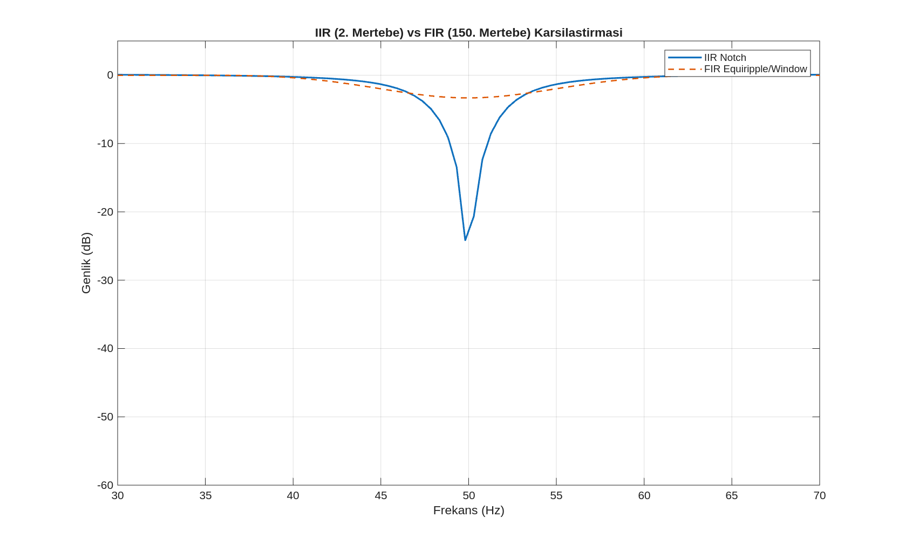
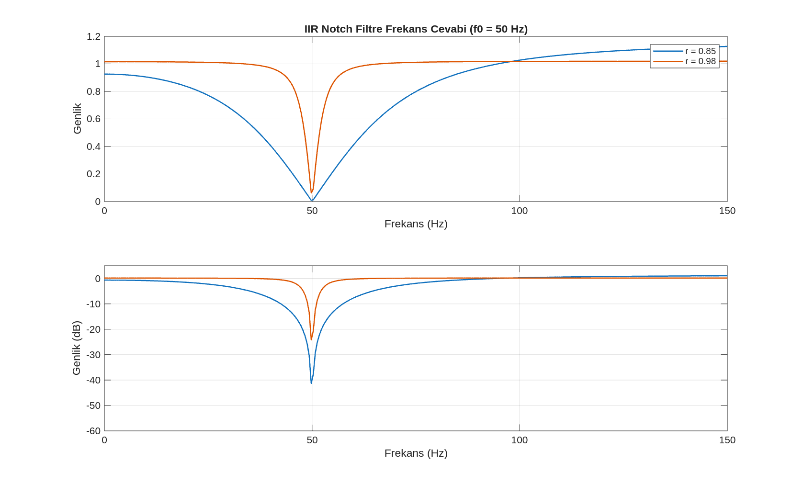
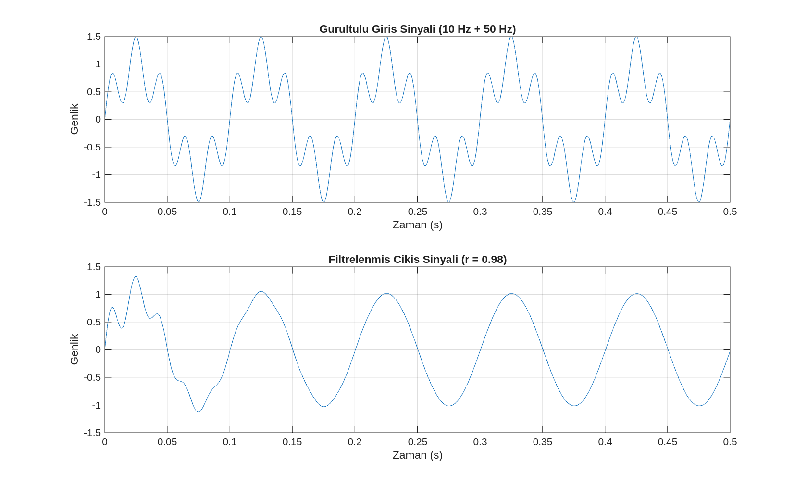

# iir filtre tasarimi ve temel karakteristikler

sayisal sinyal islemede, fir filtrelerin sundugu kararlilik ve lineer faz avantajlarina karsin, yuksek hesaplama verimliligi ve keskin frekans seciciligi saglayan **iir (sonsuz durtu yaniti)** filtre yapilari kritik bir oneme sahiptir. bu bolumde, iir filtrelerin temel calisma prensipleri, geri besleme mekanizmasi ve kararlilik kriterleri incelenmektedir.

---

### 1. iir ve fir filtre yapilarinin karsilastirmali analizi

iir filtreleri fir yapilarindan ayiran temel fark, cikis sinyalinin gecmis degerlerinin tekrar sisteme dahil edilmesi, yani geri besleme (feedback) mekanizmasidir. bu yapi, filtrenin cok daha dusuk mertebelerle cok daha keskin gecis bantlari elde etmesine olanak tanir.

- **fir (sonlu durtu yaniti):** geri besleme icermez, her zaman kararlidir. ancak keskin bir gecis bandi icin cok yuksek mertebelere (n) ihtiyac duyar.
- **iir (sonsuz durtu yaniti):** geri besleme icerir. daha az katsayi ile yuksek performans saglar ancak kutuplarin konumu nedeniyle kararsizlik riski tasir.

---

### 2. matematiksel model ve transfer fonksiyonu

bir iir filtresi, fark denklemi (difference equation) ile asagidaki sekilde ifade edilmektedir:

$$y[n] = \sum_{k=0}^{M} b_k x[n-k] - \sum_{k=1}^{N} a_k y[n-k]$$

burada $b_k$ ileri yol (feedforward) katsayilarini, $a_k$ ise geri besleme (feedback) katsayilarini temsil eder. sistemin z-duzlemindeki transfer fonksiyonu $h(z)$ ise su sekildedir:

$$h(z) = \frac{\sum_{k=0}^{M} b_k z^{-k}}{1 + \sum_{k=1}^{N} a_k z^{-k}}$$

---

### 3. kararlilik ve kutup-sifir analizi

iir filtrelerinin tasariminda en kritik asama kararlilik kontroludur. bir sistemin kararli olabilmesi icin transfer fonksiyonunun tum kutuplarinin z-duzlemindeki birim cemberin icerisinde ($|z| < 1$) yer almasi gerekmektedir.

- **kutup (pole) konumu:** kutuplar birim cembere yaklastikca filtrenin frekans seciciligi (keskinligi) artar.
- **kararsizlik riski:** eger herhangi bir kutup birim cember uzerine veya disina cikarsa, sistemin cikisi sonsuza gider ve filtre kullanilamaz hale gelir.

---

### 4. uygulama: 50/60 hz sebeke gurultusu bastirma (notch filtre)

iir filtrelerin en yaygin uygulama alanlarindan biri, dar bantli durdurma islemi yapan notch filtrelerdir. ozellikle sebeke kaynakli 50 hz veya 60 hz gurultulerin temizlenmesinde, iir yapisi sayesinde cok dar bir durdurma bandi elde edilebilmektedir.

#### kutup yaricapi ($r$) etkisi
notch filtre tasariminda kutup yaricapi, filtrenin bant genisligini doğrudan etkiler. $r$ degeri 1'e yaklastikca filtre daha dar ve keskin bir karakter kazanir.

---

### 5. analiz ve gorsellestirme

gerceklestirilen iir tasarim analizleri, sistemin hem frekans hem de zaman alanindaki performansini ortaya koymaktadir.

#### iir ve fir mertebe karsilastirmasi
ayni frekans cevabini elde etmek icin iir ve fir filtrelerin ihtiyac duydugu mertebeler karsilastirildiginda, iir yapisinin cok daha ekonomik oldugu gozlemlenmektedir. ornegin, bir fir filtresinin 100. mertebede sagladigi keskinligi, bir iir filtresi 4. veya 6. mertebede saglayabilmektedir.

<p align="center">
  
</p>

#### notch filtre ve kararlilik analizi
notch filtre tasariminda kutuplarin birim cember icindeki konumu, filtrenin hem kararliligini hem de seciciligini belirler. asagidaki gorselde, kutup konumlarinin frekans cevabi uzerindeki etkisi ve sebeke gurultusunun bastirilma orani gosterilmektedir.

<p align="center">
  
</p>

#### zaman alaninda sebeke gurultusu temizleme
tasarlanan iir notch filtresinin gercek bir sinyal uzerindeki etkisi, 50 hz bileseninin sinyalden temizlenmesiyle dogrulanmistir. gurultulu giris sinyali ile filtrelenmis cikis sinyali arasindaki fark, iir filtrelerin dar bantli bastirma yetenegini kanitlamaktadir.

<p align="center">
  
</p>

---

### 6. matlab uygulama kodlari

asagidaki kodlar, iir filtre tasarimi ve performans analizleri icin kullanilan temel algoritmalari icermektedir.

#### iir notch filtre tasarimi
```matlab
% iir_notch_design.m
% 50 hz sebeke gurultusu icin iir notch filtre tasarimi
clc; clear; close all;

fs = 1000; f0 = 50; r = 0.95;
w0 = 2*pi*f0/fs;
b = [1 -2*cos(w0) 1];
a = [1 -2*r*cos(w0) r^2];

% frekans cevabi ve gorsellestirme kodlari matlab/ klasorundedir
saveas(gcf, '../assets/notch_analysis.png');
```

---

**onemli not:** iir filtrelerde geri besleme nedeniyle olusan kuantalama hatalari, ozellikle sabit noktali (fixed-point) donanimlarda kararlilik sorunlarina yol acabilecegi icin tasarimda katsayi hassasiyeti dikkate alinmalidir.
