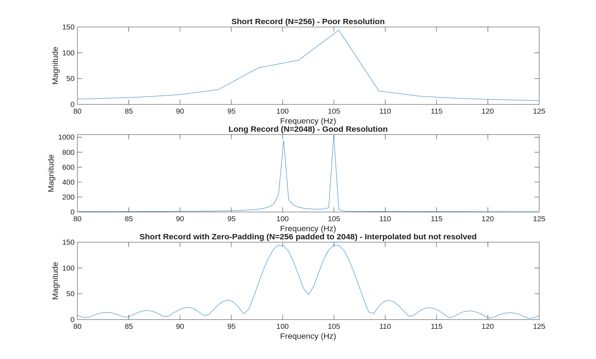
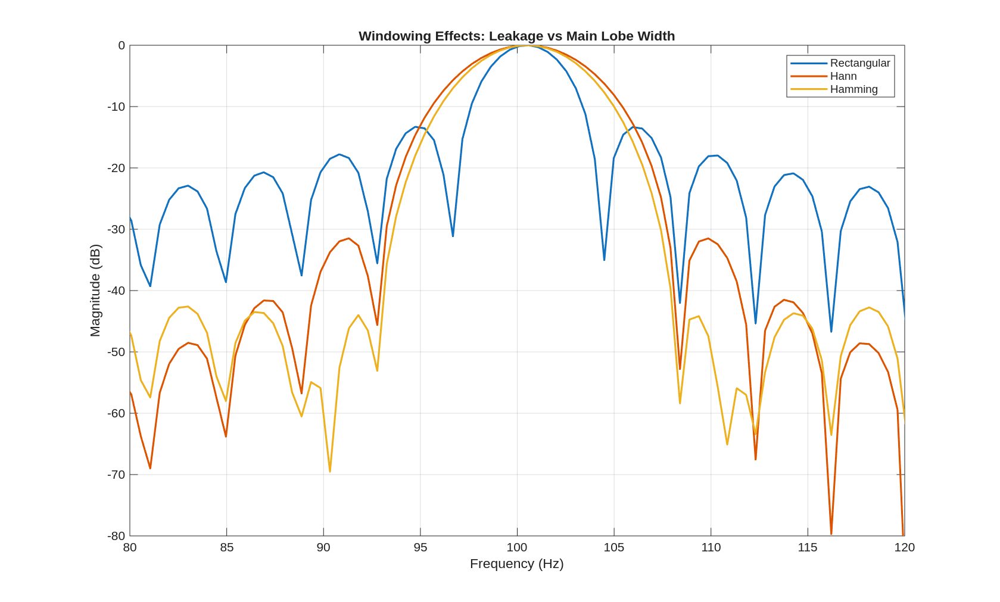
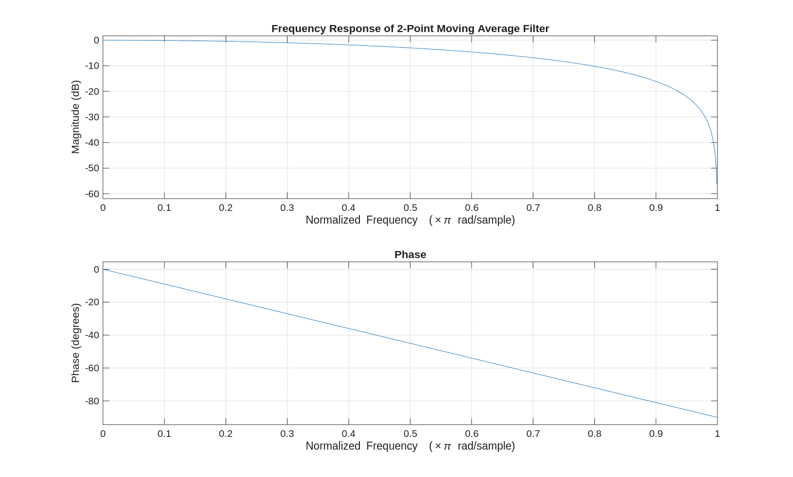
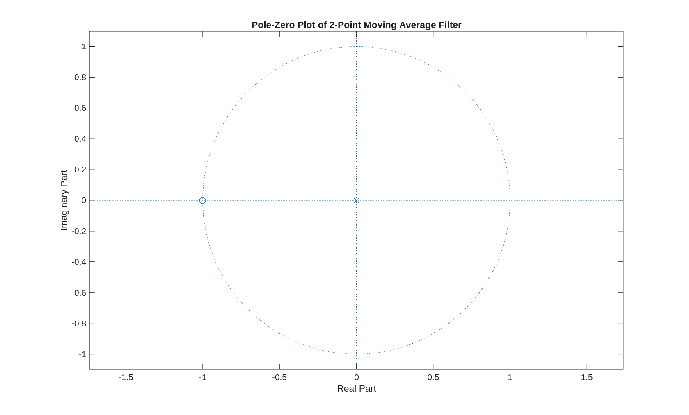
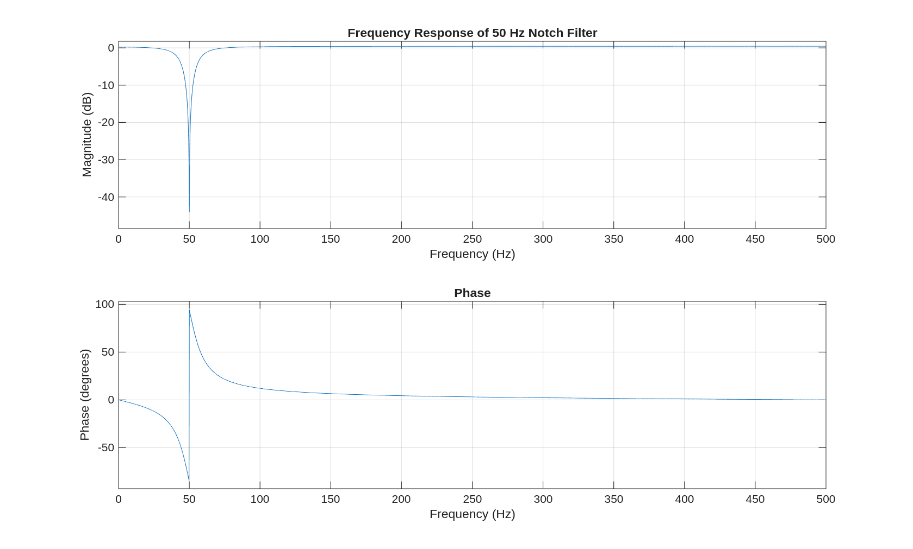
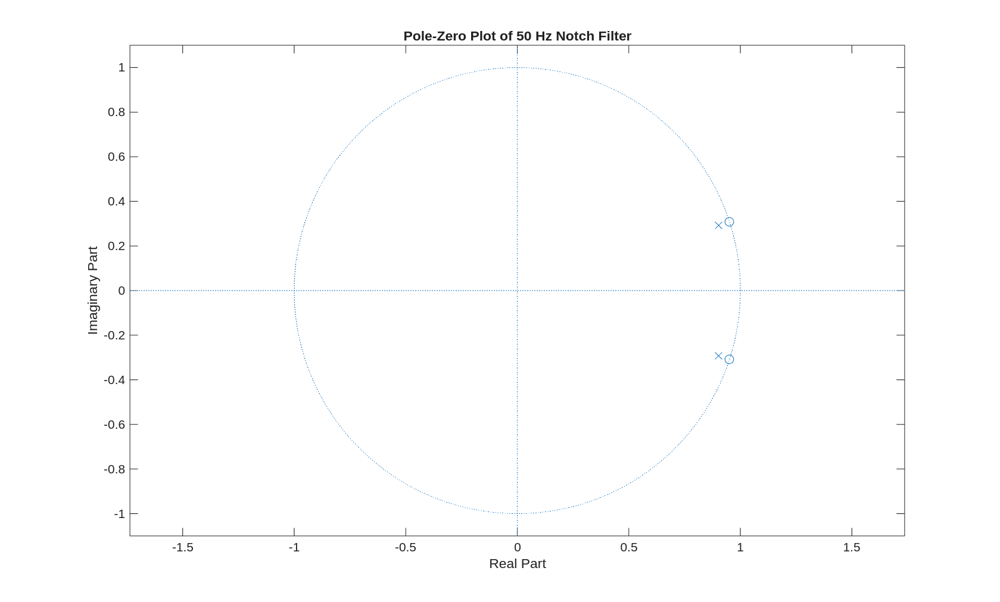

# Sayısal İşaret İşlemeye (DSP) Giriş ve Frekans Alanı Analizi

## 1. İşaret İşleme Akışı ve Frekans Alanı Analizi
Sayısal İşaret İşleme (DSP - Digital Signal Processing), fiziksel dünyadan elde edilen gerçek zamanlı verilerin (ses, sensör, biyomedikal sinyaller vb.) matematiksel ve algoritmik yöntemlerle analiz edilmesini sağlar.

İşaret işleme sistemlerinde temel akış genellikle şu adımlardan oluşur:
**Veri → Ön İşleme → Spektral Analiz → Filtreleme → Özellik Çıkarımı → Karar/Yorum**

Bu akıştaki en kritik adımlardan biri, zaman alanında (time domain) anlaşılamayan sinyal özelliklerinin **frekans alanında (frequency domain)** analiz edilmesidir. Frekans alanı analizi ile gürültü, harmonikler ve sistemin rezonans frekansları net bir şekilde ayrıştırılabilir.

**Örnek Durumlar:**
- **50 Hz Şebeke Gürültüsü:** Biyomedikal sinyallerde (örneğin ECG) zaman alanında ana sinyale karışmış dalgalanmalar olarak görülen bu gürültü, frekans alanında tam 50 Hz'de belirgin bir tepe (peak) olarak ortaya çıkar. Tespiti yapıldıktan sonra *Notch (Çentik) filtre* ile sistemden çıkarılabilir.
- **Motor Titreşimleri ve Harmonikler:** Dönel bir makineden alınan karmaşık titreşim sinyali frekans alanına dönüştürüldüğünde, temel frekans ve onun katları (harmonikleri) birbirinden ayrık tepeler şeklinde gözlemlenerek sistemdeki arızalar tespit edilebilir.

## 2. Fourier Serisi ve Harmonikler
Eğer bir sinyal periyodik ise (kendisini belirli bir periyotta tekrarlıyorsa), bu sinyal farklı frekanslardaki sinüs ve kosinüs dalgalarının toplamı olarak ifade edilebilir. Bu ifade **Fourier Serisi** olarak adlandırılır.

**Genel Denklem:**
$$ x(t) = a_0 + \sum_{n=1}^{\infty} \left[ a_n \cos(n\omega_0 t) + b_n \sin(n\omega_0 t) \right] $$
Burada:
- $\omega_0 = \frac{2\pi}{T}$ temel açısal frekanstır.
- $a_0$ sinyalin DC (ortalama) bileşenidir.
- $n$ değeri, temel frekansın kaçıncı harmoniği olduğunu gösterir.

**Detaylı Örnek: Kare Dalga**
İdeal bir kare dalga periyodik bir sinyaldir ve yalnızca tek harmoniklerin (1, 3, 5, ...) toplamı ile oluşur:
$$ x(t) \approx \frac{4}{\pi} \left[ \sin(\omega_0 t) + \frac{1}{3}\sin(3\omega_0 t) + \frac{1}{5}\sin(5\omega_0 t) + \cdots \right] $$
- **Temel Frekans ($\omega_0$):** Sinyalin ana karakteristiğini belirler (katsayısı 1).
- **3. Harmonik ($3\omega_0$):** Temel frekansın 3 katıdır, gücü üçte birine ($\frac{1}{3}$) düşmüştür.
- **5. Harmonik ($5\omega_0$):** Temel frekansın 5 katıdır, gücü beşte birine ($\frac{1}{5}$) düşmüştür.
Yüksek frekanslı (n değeri büyük) harmoniklerin genlikleri küçülse de, kare dalganın o "köşeli" ve ani değişen kısımlarını oluşturmaktan sorumludurlar. Gerçek sistemlerde sonsuz sayıda harmonik toplanamayacağı için belirli bir yerde kesme yapılır ve köşelerde "Gibbs Olgusu" (çınlama) adı verilen dalgalanmalar görülür.

## 3. Fourier Dönüşümü: Periyodik Olmayan Sinyaller
Gerçek dünyadaki birçok sinyal (kısa bir ses kaydı, darbe sinyali, rastgele sensör verisi) periyodik değildir. Bu sinyallerin frekans analizinde Fourier Serisi yerine **Fourier Dönüşümü** kullanılır.

- **Çizgisel Spektrum:** Sinyal periyodik olduğunda frekans alanında sadece belirli harmoniklerde enerji bulunur. Grafikte tek tek çizgiler görülür.
- **Sürekli Spektrum:** Sinyal periyodik olmadığında enerji tek bir frekansa odaklanmaz, geniş bir frekans bandına dağılır. Grafikte kesintisiz sürekli bir eğri elde edilir.

## 4. Ayrık Zamanlı Fourier Dönüşümü (DTFT) ve Normalize Frekans
Dijital sistemlerde veriler sürekli (continuous) değil, belirli bir $f_s$ (örnekleme frekansı) ile örneklenmiş ayrık (discrete) zamanlı sinyallerdir ($x[n]$). Bu sinyallerin frekans analizi için **DTFT (Discrete-Time Fourier Transform)** kullanılır.

**DTFT Formülü:**
$$ X(e^{j\omega}) = \sum_{n=-\infty}^{\infty} x[n] e^{-j\omega n} $$

Dijital sistemlerde frekans analizi yapılırken "Hertz (Hz)" birimi yerine, radyan/örnek cinsinden **normalize açısal frekans ($\omega$)** kavramı kullanılır.

**Frekans Dönüşüm Formülü:**
$$ \omega = 2\pi \frac{f}{f_s} \iff f = \frac{\omega \cdot f_s}{2\pi} $$

**Detaylı Örnek:**
Bir sistemi $f_s = 1000 \text{ Hz}$ ile örneklediğimizi varsayalım.
- $250 \text{ Hz}$'lik bir sinyalin normalize frekansı ne olur?
  $$ \omega = 2\pi \frac{250}{1000} = \frac{\pi}{2} \text{ radyan/örnek} $$
- Sistemde ifade edilebilecek en yüksek frekans (Nyquist frekansı) $\frac{f_s}{2} = 500 \text{ Hz}$'dir. Bunun normalize frekanstaki karşılığı her zaman $\pi$'dir.
  $$ \omega = 2\pi \frac{500}{1000} = \pi \text{ radyan/örnek} $$
Bu nedenle dijital spektrum analizleri genellikle $[-\pi, \pi]$ aralığında değerlendirilir.

## 5. Ayrık Fourier Dönüşümü (DFT) ve Hızlı Fourier Dönüşümü (FFT)
DTFT sürekli bir denklem ürettiği için bilgisayarda doğrudan hesaplanamaz. Bunun yerine spektrum belirli noktalardan örneklenerek sayısal hale getirilir, buna **Ayrık Fourier Dönüşümü (DFT)** denir. DFT'nin çok hızlı hesaplanmasını sağlayan algoritmaya ise **FFT (Fast Fourier Transform)** denir.

**Frekans Çözünürlüğü ($\Delta f$):**
FFT grafiğinde yatay eksendeki her bir adımın (bin) kaç Hz'e denk geldiğini gösterir. Birbirine yakın iki frekansı birbirinden ayırmak için çözünürlüğün yüksek ($\Delta f$'nin küçük) olması gerekir.
$$ \Delta f = \frac{f_s}{N} $$
Burada $N$, FFT'ye sokulan örnek sayısıdır (kayıt uzunluğu).

**Detaylı Örnek:**
Sinyalimizde $100 \text{ Hz}$ ve $100.5 \text{ Hz}$ frekanslarında iki farklı bileşen olsun. Örnekleme frekansı $f_s = 1000 \text{ Hz}$ olsun.
- **Kısa Kayıt:** Sinyalden sadece $N=1000$ örnek (1 saniye) alırsak:
  $$ \Delta f = \frac{1000}{1000} = 1 \text{ Hz} $$
  Çözünürlük 1 Hz olduğu için, FFT bu iki frekansı (aralarındaki fark 0.5 Hz) tek bir geniş tepe gibi gösterir, ayırt edemez.
- **Uzun Kayıt:** Sinyalden $N=4000$ örnek (4 saniye) alırsak:
  $$ \Delta f = \frac{1000}{4000} = 0.25 \text{ Hz} $$
  Çözünürlük 0.25 Hz olduğu için, FFT grafiğinde $100 \text{ Hz}$ ve $100.5 \text{ Hz}$'de iki net ve ayrı tepe görülür.

*(Not: Sıfır ekleme (zero-padding) yöntemi ile sinyalin sonuna "0" eklendiğinde grafikteki nokta sayısı artar ve grafik yumuşar. Ancak sıfır eklemek, sinyale yeni bir bilgi katmadığı için gerçek frekans çözünürlüğünü (ayırt etme gücünü) artırmaz.)*

  

**Grafik Analizi (`fft_analysis.m`):**
Yukarıdaki grafik, kayıt uzunluğunun ($N$) ve sıfır ekleme (zero-padding) işleminin frekans çözünürlüğüne etkisini kanıtlamaktadır.
- **Üst Grafik ($N=256$):** Kayıt süresi çok kısa olduğu için çözünürlük düşüktür. Sinyalin içindeki birbirine çok yakın olan 100 Hz ve 105 Hz bileşenleri birbirinden ayrılamamış, tek bir kalın tepe gibi görünmüştür.
- **Orta Grafik ($N=2048$):** Kayıt süresi uzatıldığında $\Delta f$ küçülmüş (frekans çözünürlüğü artmış) ve 100 Hz ile 105 Hz'deki iki ayrı tepe çok net olarak ayrışmıştır.
- **Alt Grafik (Zero-Padding ile $N=2048$):** Kısa bir kayda sonradan sıfırlar eklenip FFT alınmıştır. Eğri daha yumuşak ve noktaları sık çizilmiş olsa da, frekansları ayırt etme gücü artmamıştır; tepe hala tek ve geniştir. Bu durum, sıfır eklemenin *gerçek çözünürlüğü artırmadığını* görsel olarak doğrular.

## 6. Pencereleme (Windowing) ve Sızıntı (Leakage)
FFT alabilmek için sonsuz uzunluktaki sinyaller mecburen belirli bir $N$ noktasında "kesilir". Zaman alanında bir sinyali aniden kesmek, frekans alanında enerjinin olması gereken frekanstan taşıp komşu frekanslara yayılmasına, yani **sızıntıya (leakage)** neden olur. Sızıntıyı kontrol etmek için "Pencere (Window)" fonksiyonları kullanılır.

- **Dikdörtgen (Rectangular) Pencere:** Sinyal kesildiği noktada aniden sıfıra düşer. Ana lob dardır ancak yan loblar (side lobes) çok yüksektir. Bu da sızıntının devasa boyutlara ulaşmasına sebep olur.
- **Hann / Hamming Pencereleri:** Sinyalin kenarlarını aniden değil, çan eğrisi gibi yumuşatarak sıfıra indirir. Yan lobları ciddi şekilde bastırdığı için sızıntıyı çok azaltır. Ancak bunun karşılığında frekanstaki ana tepe (ana lob) genişler. (Çözünürlük bir miktar düşer).

  

**Grafik Analizi (`windowing_effects.m`):**
Yukarıdaki grafik, farklı pencere fonksiyonlarının sızıntı (leakage) ve çözünürlük (ana lob genişliği) üzerindeki temel ödünleşimini (trade-off) göstermektedir.
- **Dikdörtgen Pencere (Mavi Çizgi):** Ana tepe (main lobe) en dardır (iyi çözünürlük). Ancak enerjinin yan frekanslara çok fazla yayıldığı (yüksek yan loblar, kötü sızıntı) görülmektedir.
- **Hann ve Hamming Pencereleri:** Yan frekanslara sızan enerji ciddi şekilde bastırılarak sızıntı minimuma indirilmiştir. Ancak bunun bedeli olarak ana tepe, dikdörtgen pencereye kıyasla genişlemiş ve bir miktar çözünürlük kaybı yaşanmıştır.

- [Spektrum Analizi ve FFT Temelleri](../spectrum_analysis_fft/README.md) - Ham veri işleme, Nyquist, Aliasing ve profesyonel FFT analizi.

## 7. Filtreler, Fark Denklemleri ve Z-Dönüşümü
Sinyali şekillendirmek (örneğin yüksek frekanslı gürültüyü atmak) için Sayısal Filtreler kullanılır. Bu filtreler yazılımsal olarak bir **Fark Denklemi (Difference Equation)** ile tanımlanır.

$$ y[n] = \sum_{k=0}^{M} b_k x[n-k] - \sum_{k=1}^{P} a_k y[n-k] $$
($x[n]$: giriş, $y[n]$: çıkış, $b_k$: ileri besleme katsayıları, $a_k$: geri besleme katsayıları)

- **FIR (Finite Impulse Response):** Sadece geçmiş girişlere ($x[n-k]$) dayanır. $a_k$ katsayıları sıfırdır. Kararlıdır ve tasarımı güvenilirdir.
- **IIR (Infinite Impulse Response):** Çıkışın geçmiş değerleri ($y[n-k]$) tekrar sisteme girer (Geri besleme). Çok daha düşük mertebelerle (az katsayıyla) çok keskin filtreler yapılabilir ancak kararsız (unstable) olma riski taşır.

Fark denklemi **Z-Dönüşümü** kullanılarak bir Transfer Fonksiyonuna ($H(z)$) dönüştürülür:
$$ H(z) = \frac{\sum_{k=0}^{M} b_k z^{-k}}{1 + \sum_{k=1}^{P} a_k z^{-k}} = \frac{B(z)}{A(z)} $$

**Detaylı Örnek: Basit Hareketli Ortalama Filtresi**
İki noktalı bir hareketli ortalama filtresinin fark denklemi şudur:
$$ y[n] = \frac{1}{2}x[n] + \frac{1}{2}x[n-1] $$
(Sistemin şu anki değeri ile bir önceki değerinin ortalamasını alır, böylece ani değişimleri yani yüksek frekansları yumuşatır, bu bir Alçak Geçiren (Low-Pass) FIR filtredir.)
Z-dönüşümü alınırsa ($x[n-1] \rightarrow z^{-1}X(z)$):
$$ Y(z) = \frac{1}{2}X(z) + \frac{1}{2}z^{-1}X(z) $$
Transfer fonksiyonu:
$$ H(z) = \frac{Y(z)}{X(z)} = \frac{1}{2} + \frac{1}{2}z^{-1} = \frac{1 + z^{-1}}{2} $$

  
  

**Grafik Analizi (`moving_average_filter.m`):**
- **Frekans Yanıtı (Sol Grafik):** Sistemin düşük frekansları olduğu gibi geçirdiği (0 Hz'de genlik maksimum), yüksek frekanslara doğru gittikçe zayıflattığı görülmektedir. Bu tipik bir Alçak Geçiren (Low-Pass) filtre davranışıdır.
- **Kutup-Sıfır Haritası (Sağ Grafik):** Z-düzleminde $-1$ konumunda (yani birim çemberin sol ucu olan ve en yüksek frekansa karşılık gelen $\pi$ noktasında) bir sıfır (O işareti) bulunmaktadır. Frekans yanıtındaki yüksek frekans sönümlemesinin temel sebebi bu sıfırdır. Sistemin kutbu (X işareti) ise orjin olan $0$ noktasındadır (FIR filtrelerin genel özelliğidir).

## 8. Kutup-Sıfır Haritası ve Birim Çember
$H(z) = \frac{B(z)}{A(z)}$ fonksiyonunda:
- Payı ($B(z)$) sıfır yapan köklere **Sıfır (Zero)** denir. Bulundukları frekansı *bastırırlar*.
- Paydayı ($A(z)$) sıfır yapan köklere **Kutup (Pole)** denir. Bulundukları frekansı *vurgularlar (rezonans)*.

Filtrenin frekans cevabı, kompleks Z-düzleminde yarıçapı 1 olan **Birim Çember ($z = e^{j\omega}$)** üzerinde gezinerek bulunur. Birim çember üzerinde ilerledikçe frekans artar. $\omega=0$ radyan çemberin sağ ucudur (0 derece), $\omega=\pi$ radyan çemberin sol ucudur (180 derece).

**Detaylı Örnek: 50 Hz Notch (Çentik) Filtre Tasarımı**
$f_s = 1000 \text{ Hz}$ örnekleme yapılan bir sistemde 50 Hz şebeke gürültüsünü silmek istiyoruz.
- Hedef normalize frekans: $\omega_0 = 2\pi \frac{50}{1000} = 0.1\pi \text{ radyan}$
- Filtrenin 50 Hz'i yok etmesi (bastırması) için, birim çemberin tam üzerine, $0.1\pi$ açısına denk gelen noktaya ($z = e^{j0.1\pi}$) bir **sıfır** yerleştirilmelidir.
- Bu sıfırın etkisini sadece o dar bantta tutmak için, sıfırların hemen arkasına (birim çemberin hafifçe içine, örneğin yarıçapı $r=0.95$ olan konuma) **kutuplar** yerleştirilir. Böylece 50 Hz tam olarak sıfırlanırken, 49 Hz ve 51 Hz gibi komşu frekanslar sistemden bozulmadan geçer.

  
  

**Grafik Analizi (`notch_filter_design.m`):**
- **Frekans Yanıtı (Sol Grafik):** Frekans ekseninde tam olarak 50 Hz'de çok derin ve dar bir "çentik" (notch) oluşmuştur. Bu, filtrenin sadece 50 Hz'deki sinyali (şebeke gürültüsü) tamamen sıfırlayacağını ve sileceğini gösterir.
- **Kutup-Sıfır Haritası (Sağ Grafik):** 50 Hz'in denk geldiği açıya ($0.1\pi$ radyan) birim çemberin tam üzerine iki adet sıfır (O) yerleştirilmiştir. Bu sıfırların hemen arkasında ($r=0.95$ yarıçapında) ise kutuplar (X) yer almaktadır. Kutupların amacı; sıfırın yarattığı zayıflama etkisini sadece 50 Hz çevresiyle (dar bantta) sınırlı tutarak, çentiğin çok daha dar ve keskin olmasını sağlamaktır. Böylece gürültü yok edilirken komşu veri frekansları (örneğin 48 Hz veya 52 Hz) filtreden hasar görmeden geçebilir.

## 9. Kararlılık (Stability)
Sayısal sistemlerde, sınırlı bir giriş verildiğinde çıkışın da sınırlı bir değerde kalması durumuna **BIBO (Bounded-Input Bounded-Output)** kararlılığı denir. IIR filtrelerde geri besleme olduğu için kararlılık hayati öneme sahiptir.

**Kararlılık Kuralı:** Nedensel (causal) bir sistemin kararlı olabilmesi için, Z-düzlemindeki **tüm kutupları birim çemberin İÇİNDE** ($|p_i| < 1$) bulunmalıdır.

**Detaylı Örnek:**
Bir filtrenin transfer fonksiyonu $H(z) = \frac{1}{1 - 1.2z^{-1}}$ olsun.
Kutbu bulmak için paydayı sıfıra eşitleriz: $1 - 1.2z^{-1} = 0 \implies z = 1.2$.
Kutup noktası ($|z|=1.2$), yarıçapı 1 olan birim çemberin dışındadır. Sisteme küçük bir darbe (impulse) girişi uygulansa bile, geri besleme katsayısı (1.2) birden büyük olduğu için sinyal her adımda katlanarak büyüyecek ve sistem çıkışı sonsuza gidip patlayacaktır (kararsızdır). Bu nedenle IIR filtre tasarlanırken kutupların mutlak suretle 1'den küçük ayarlanması gerekir.
