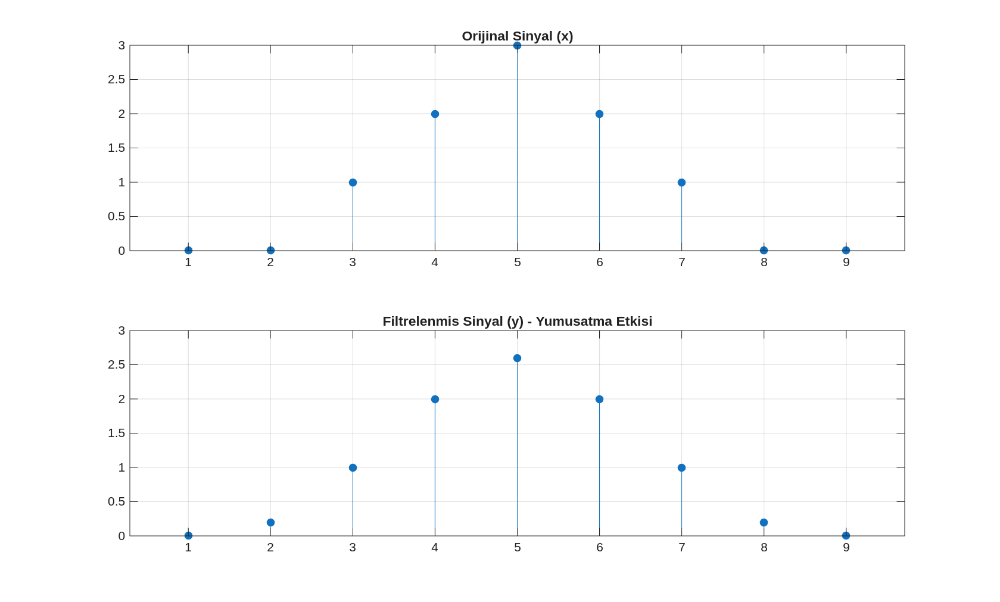
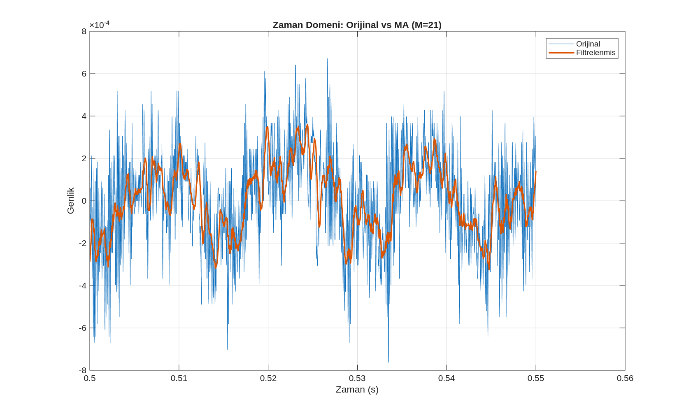
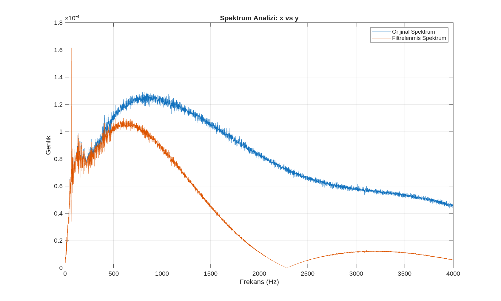
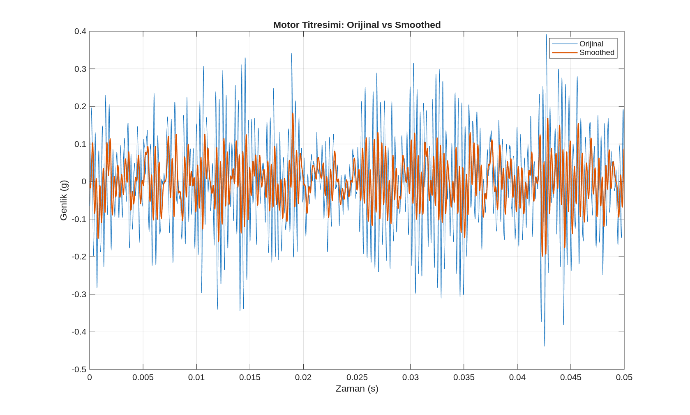
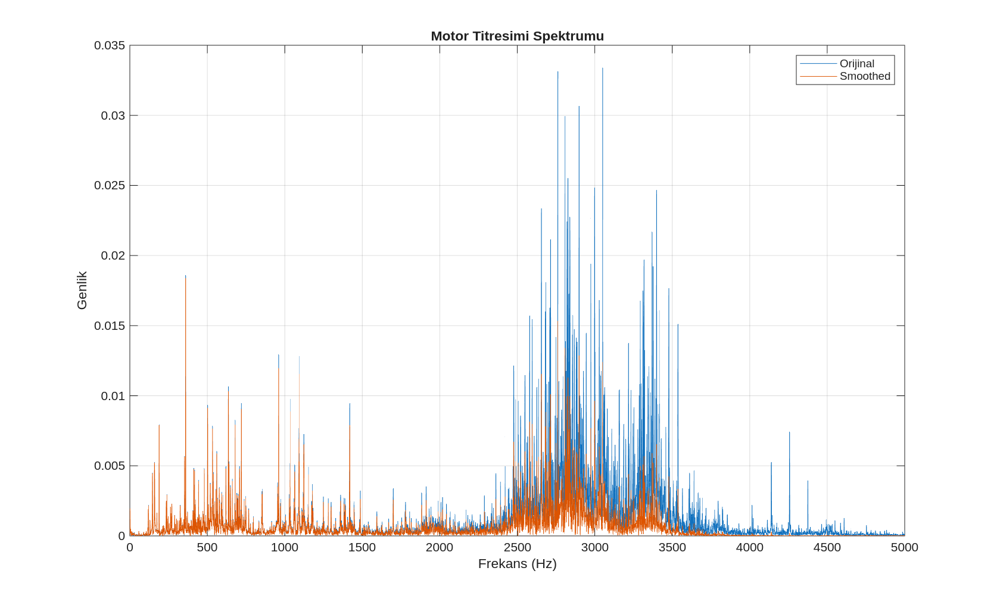

# LTI Sistemler, Konvolüsyon ve Temel Filtreleme

Bu bölümde, sayısal sinyal işlemenin temel yapı taşlarından olan Lineer Zamanla Değişmez (LTI) sistemler, konvolüsyon işlemi ve sonlu dürtü yanıtlı (FIR) filtreler incelenmektedir. Özellikle en yaygın kullanılan yumuşatma (smoothing) yöntemi olan Moving Average (Hareketli Ortalama) filtresi üzerinde durulmaktadır.

## 1. LTI Sistemler ve Karakterizasyonu

Sinyal işleme zincirinde giriş sinyalini işleyip bir çıktı üreten yapılar "sistem" olarak adlandırılır. Matematiğin ve analizin kolaylaşması için sistemlerin şu iki temel özelliğe sahip olduğu varsayılır:

*   **Lineerlik (Linearity):** Sistemin girişindeki sinyallerin toplamına verdiği tepki, sinyallere ayrı ayrı verdiği tepkilerin toplamına eşittir.
*   **Zamanla Değişmezlik (Time-Invariance):** Sistemin özellikleri zamanla değişmez.

**Kaynak Dosya:** `lti_system_tests.m`

## 2. Konvolüsyon (Katlama Toplamı)

Bir LTI sistemin herhangi bir giriş sinyaline (x[n]) vereceği tepki (y[n]), giriş sinyali ile sistemin dürtü yanıtının (h[n]) konvolüsyonu ile hesaplanır.

  
   
  <em>Görsel 1: Konvolüsyon işleminin sinyal üzerindeki yumuşatma etkisi.</em>

**Kaynak Dosya:** `convolution_demo.m`

## 3. FIR Filtreler ve Moving Average

### Moving Average (Hareketli Ortalama) Filtresi
Sinyaldeki ani değişimleri ve gürültüyü bastırarak sinyali yumuşatır. Frekans domeninde alçak geçiren (low-pass) filtre karakterindedir.

#### Ses Verisi Analizi
Ses sinyali üzerindeki zaman ve frekans domeni etkileri aşağıda gösterilmiştir:

  
  
   
  <em>Görsel 2: Ses verisinde zaman (sol) ve frekans (sağ) domeni filtreleme sonuçları.</em>

**Kaynak Dosya:** `moving_average_audio.m`

#### Motor Titreşim Analizi
CWRU motor verilerinde gürültü tabanının bastırılması:

  
  
   
  <em>Görsel 3: Motor titreşim verilerinde smoothing etkisi.</em>

**Kaynak Dosya:** `motor_vibration_smoothing.m`

## 4. Filtreleme Bedelleri
1.  **Gecikme (Delay):** Çıktı sinyali girişe göre bir miktar gecikir.
2.  **Detay Kaybı:** Yüksek frekanslı önemli detaylar yumuşayabilir.
3.  **M Seçimi:** Pencere uzunluğu büyüdükçe yumuşatma artar ancak detay kaybı da artar.
