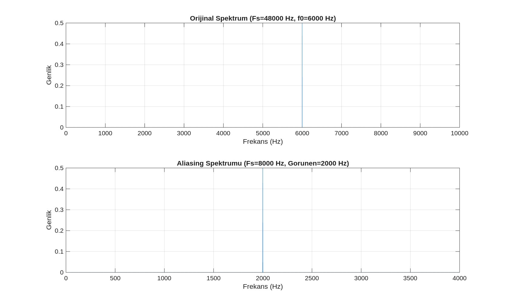
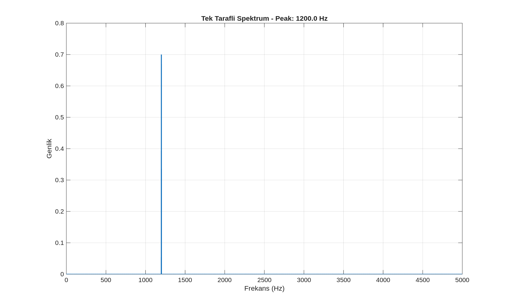

# Spektrum Analizi ve FFT Temelleri

Bu bölümde, ham veri setlerinin DSP süreçlerine uygun biçimde hazırlanması, örnekleme teorisinin pratik yansımaları olan Nyquist teoremi ve aliasing olgusu ile Hızlı Fourier Dönüşümü (FFT) kullanılarak frekans alanı analizinin gerçekleştirilmesi incelenmektedir.

---

## 1. Veri Hazırlama ve Ön İşleme Standartları

DSP süreçlerinde analiz başarısı, verinin doğru tanımlanmasına bağlıdır. Ham veriler spektral analize tabi tutulmadan önce aşağıdaki kontrol adımlarından geçirilmelidir:

- **Kanal Belirleme:** Çok kanallı verilerde (stereo ses veya çok eksenli ivmeölçer) analize uygun kanalın seçilmesi ya da kanalların ortalamasının alınması.
- **Örnekleme Frekansı ($F_s$) Doğrulaması:** Zaman ve frekans eksenlerinin hatalı ölçeklenmesini önlemek amacıyla $F_s$ değerinin kesinleştirilmesi.
- **DC Offset Giderimi:** Sensörlerden kaynaklanan statik kaymaların spektrumda $0$ Hz noktasında yapay bir tepe oluşturmaması için veriden ortalamanın çıkarılması.

> **Not:** $F_s$ değeri hatalı girildiğinde zaman ekseni, Nyquist sınırı ve FFT frekans ekseni birlikte yanlışlanır. DSP hatalarının büyük çoğunluğu bu tek kaynaktan beslenmektedir.

---

## 2. Temel Kavramlar ve Matematiksel Modeller

### 2.1. Zaman Ekseni ve Örnekleme Frekansı

Ayrık zamanlı bir sinyalin zaman ekseni, örnekleme frekansına ($F_s$) bağlı olarak kurulur. $n$ örnek indisini temsil etmek üzere:

$$t[n] = \frac{n}{F_s}$$

**Sayısal Örnek:** $F_s = 48\,000\,\text{Hz}$ olan bir sistemde $48\,000$. örnek ($n = 47\,999$) tam olarak $t = 1$ saniyeye karşılık gelir. $F_s$ değeri yanlış bilinirse, "5 saniye" olduğu varsayılan kayıt aslında 1.25 saniye uzunluğunda olabilir; frekans ekseni de buna bağlı olarak hatalı etiketlenir.

### 2.2. Nyquist Teoremi ve Aliasing

Sinyaldeki en yüksek frekans bileşeninin $f_{\max}$ bilgi kaybı olmaksızın dijitalleştirilebilmesi için örnekleme hızının en az iki katı olması zorunludur:

$$f_N = \frac{F_s}{2} \qquad \text{(Nyquist frekansı)}$$

Eğer sinyalde $f_N$ değerinden daha yüksek frekanslı bileşenler bulunuyorsa, bu bileşenler düşük frekans bölgesine **katlanarak (aliasing)** hatalı bir spektrum üretir.

**Sayısal Örnek:** $6\,\text{kHz}$'lik bir sinüs dalgası $F_s = 8\,\text{kHz}$ ile örneklenirse, Nyquist sınırı $4\,\text{kHz}$ olduğundan bu bileşen $|8000 - 6000| = 2\,\text{kHz}$'de gözlemlenir; yani gerçek frekansı değil, katlanmış görüntüsü okunur.

<p align="center">
  
  <br>
  <em>Görsel 1: Aliasing demosu. Sol grafik 48 kHz ile örneklenen orijinal 6 kHz tonunu göstermekte, sağ grafik ise 8 kHz'e downsample edildiğinde 2 kHz'de beliren sahte (alias) bileşeni ortaya koymaktadır. Her iki grafikte de FFT genliği $N$ ile normalize edilmiş; frekans ekseni $f[k] = k \cdot F_s/N$ formülüyle kurulmuştur.</em>
</p>

**Pratikte Seçim Kuralı:** İlgili bant $f_{\max}$ olduğunda $F_s \approx (5\text{–}10) \times f_{\max}$ seçilmesi, aliasing ile birlikte filtreleme ve analiz aşamalarında da önemli bir güvenlik marjı sağlar. Örneğin konuşma sinyali için anlaşılabilir içerik çoğunlukla $4\,\text{kHz}$ altında kaldığından $F_s = 8\,\text{kHz}$ yeterli olmakla birlikte, bu çalışmadaki ses verisi $F_s = 48\,\text{kHz}$ ile kaydedilmiştir.

### 2.3. Frekans Çözünürlüğü ($\Delta f$)

FFT analizinde iki yakın frekans bileşenini birbirinden ayırt etme kapasitesi doğrudan kayıt süresine ($T$) bağlıdır:

$$\Delta f = \frac{F_s}{N} = \frac{1}{T}$$

Burada $N$ toplam örnek sayısıdır.

**Sayısal Örnek:** $F_s = 48\,\text{kHz}$ olan sistemde;

| Kayıt Süresi | $N$ | $\Delta f$ |
|:---:|:---:|:---:|
| $0.25\,\text{s}$ | $12\,000$ | $4.00\,\text{Hz}$ |
| $1.00\,\text{s}$ | $48\,000$ | $1.00\,\text{Hz}$ |
| $2.00\,\text{s}$ | $96\,000$ | $0.50\,\text{Hz}$ |

Kayıt süresi kısa tutulduğunda $\Delta f$ büyür; birbirine yakın frekans bileşenleri (örneğin $100\,\text{Hz}$ ve $101\,\text{Hz}$) tek bir geniş tepe halinde birleşir.

---

## 3. FFT Frekans Ekseni ve Tek Taraflı Spektrum

### 3.1. Frekans Ekseni Kurulumu

FFT çıktısı doğrudan Hz değeri vermez; sonuçlar "bin" adı verilen kutucuklarda döner. Bitlerin frekans karşılığı şu formülle kurulur:

$$f[k] = k \cdot \frac{F_s}{N}, \qquad k = 0, 1, \ldots, \frac{N}{2}$$

- $k = 0$: DC bileşeni ($0$ Hz)
- $k = N/2$: Nyquist frekansı ($F_s/2$)

### 3.2. Tek Taraflı Spektrum ve Genlik Düzeltme ($2\times$ Kuralı)

Gerçek sayılı sinyallerde FFT spektrumu simetriktir; pozitif ve negatif frekans bölgeleri birbirinin aynasıdır. Pratik analizlerde yalnızca $0\ldots F_s/2$ aralığı (tek taraf) kullanılır. Bu seçim enerjinin yarısını dışarıda bıraktığından, genlikleri doğru okumak için DC ve Nyquist hariç tüm bileşenler $2$ ile çarpılır:

$$|X_{\text{single}}[k]| = \begin{cases} |X[k]| & k = 0 \text{ veya } k = N/2 \\ 2|X[k]| & \text{diğer tüm } k \end{cases}$$

<p align="center">
  
  <br>
  <em>Görsel 2: Genlik düzeltmesi uygulanmış tek taraflı FFT spektrumu. Yatay eksen $f[k] = k \cdot F_s/N$ formülüyle Hz cinsinden kurulmuştur. Baskın tepe noktaları <code>max(mag)</code> ile tespit edilerek frekans değerleri Hz olarak raporlanmıştır.</em>
</p>

---

## 4. Baskın Frekans (Peak) Analizi

Spektral analizin pratik hedeflerinden biri sinyaldeki baskın enerji yoğunluklarını tespit etmektir.

- **Dönel Makineler:** Peak frekansı genellikle dakikadaki devir sayısıyla (RPM) doğrudan ilişkilidir.
- **Şebeke Gürültüsü:** Spektrumda $50\,\text{Hz}$ veya $60\,\text{Hz}$'de beliren keskin tepeler elektriksel paraziti işaret eder.

---

## 5. Uygulama MATLAB Kodu

### 5.1. Veri Yükleme ve Hazırlama

```matlab
% ---- wav (konusma) -------------------------------------------------------
wavFile   = 'euphoric.wav';
[x, Fs]   = audioread(wavFile);
if size(x,2) > 1, x = mean(x,2); end         % mono yap
x         = x - mean(x);                      % dc offset temizle
N         = numel(x);
t         = (0:N-1)/Fs;
fprintf('Fs = %d Hz | N = %d | sure = %.2f s\n', Fs, N, N/Fs);

% ---- cwru (titresim) -----------------------------------------------------
S         = load('B007_1_123.mat');
x_de      = S.X123_DE_time;                   % drive end kanali
Fs        = 48000;                             % veri kumesine ozgu fs degeri
N         = numel(x_de);
t         = (0:N-1)/Fs;
```

### 5.2. FFT Şablonu (Tek Taraflı, Normalize)

```matlab
% standart tek tarafli fft sablonu
N      = Fs * 1;                               % 1 saniyelik segment
xseg   = x(1:N);
X      = fft(xseg) / N;                        % n ile normalize et
K      = floor(N/2) + 1;
f      = (0:K-1) * (Fs/N);                     % frekans ekseni (hz)
mag    = abs(X(1:K));
mag(2:end-1) = 2 * mag(2:end-1);              % 2x kurali (dc/nyquist haric)

% baskın tepe noktasi
[peakVal, idx] = max(mag);
fprintf('Baskin frekans: %.2f Hz\n', f(idx));
```

---

## Veri Kaynakları

Analizlerde kullanılan ham verilere projenin kök dizinindeki `data/` klasöründen erişilebilir. Ayrıntılı bilgi için [data/README.md](../data/README.md) dosyası incelenmelidir.
