# Zaman-Frekans Analizi ve Güç Spektral Yoğunluğu (PSD)

## 1. Giriş ve Sinyal Durağanlığı Kavramı

Sinyal işleme teorisinde, sinyallerin istatistiksel özelliklerinin zaman boyunca sabit kalıp kalmaması, analiz yönteminin seçimi açısından en kritik parametredir. İstatistiksel momentleri (ortalama, varyans, otokorelasyon fonksiyonu) zamandan bağımsız olan sinyaller **durağan (stationary)** olarak tanımlanır. Ancak konuşma, müzik, biyomedikal sinyaller (EEG, EKG), sismik veriler ve döner ekipmanlardan (motor, rulman vb.) elde edilen titreşim verileri gibi gerçek dünya sinyallerinin büyük bir kısmı **durağan olmayan (non-stationary)** bir karaktere sahiptir. Durağan olmayan sinyallerde frekans içeriği zaman boyunca dinamik olarak değişim gösterir. Bu durum, klasik frekans alanı analiz yöntemlerinin yetersiz kalmasına yol açmakta ve hem zaman hem de frekans bilgisini eş zamanlı olarak koruyan gelişmiş zaman-frekans analiz tekniklerinin kullanımını zorunlu kılmaktadır.

---

## 2. Hızlı Fourier Dönüşümü (FFT) ve Temel Sınırlamaları

Hızlı Fourier Dönüşümü (FFT), Ayrık Fourier Dönüşümü'nün (DFT) hesaplama karmaşıklığını $\mathcal{O}(N^2)$ seviyesinden $\mathcal{O}(N \log_2 N)$ seviyesine indiren güçlü bir algoritmadır. Sürekli zamanlı sinyaller için Fourier Dönüşümü şu formülle ifade edilir:

$$X(f) = \int_{-\infty}^{\infty} x(t) e^{-j2\pi ft} dt$$

FFT, analize tabi tutulan sinyalin tüm gözlem süresi boyunca durağan olduğunu varsayar. Sinyalin tamamını tek bir bütün olarak ele alıp integral işlemine dahil ettiği için, spektral bileşenlerin zaman eksenindeki konum bilgisi (faz spektrumunda saklı olsa da genlik spektrumunda) tamamen kaybolur. Başka bir ifadeyle, FFT "Sinyalde hangi frekanslar mevcut?" sorusuna hassas bir şekilde yanıt verirken, bu frekansların "ne zaman" ortaya çıktığı bilgisini sunamaz.

Bu sınırlamayı somutlaştırmak amacıyla iki farklı sinyal modeli incelenmiştir:
*   **Sinyal A (Durağan):** $T = 2$ saniye boyunca kesintisiz olarak devam eden $100\text{ Hz}$ frekanslı bir sinüs dalgası.
*   **Sinyal B (Durağan Olmayan):** İlk $1$ saniyelik aralıkta $50\text{ Hz}$, ikinci $1$ saniyelik aralıkta ise $150\text{ Hz}$ frekansa sahip ardışık iki sinüs dalgası.

Zaman alanında bu iki sinyal tamamen farklı fiziksel davranışlar sergilemesine rağmen, geleneksel FFT analizinde Sinyal B'nin zamansal sıralaması ayırt edilememekte, yalnızca sinyal genelinde $50\text{ Hz}$ ve $150\text{ Hz}$ bileşenlerinin var olduğu bilgisi elde edilmektedir.

  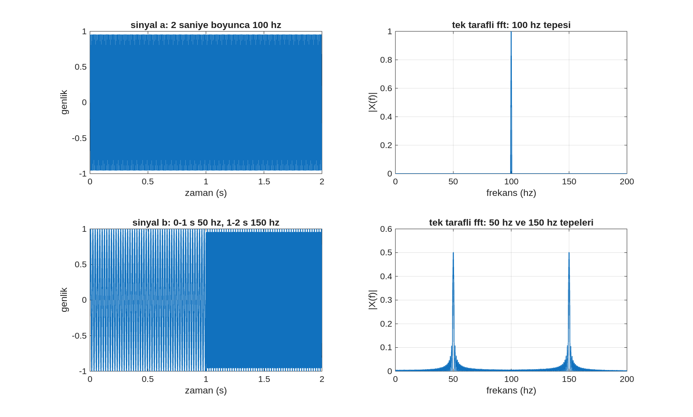
   
  <em>Görsel 1: Durağan (Sinyal A) ve durağan olmayan (Sinyal B) sinyallerin zaman alanı ve FFT genlik spektrumlarının karşılaştırılması. Sinyal B'nin zaman grafiğinde (sol alt) frekansın 1. saniyede basamaklı olarak değiştiği net olarak görülürken, tek taraflı FFT grafiğinde (sağ alt) bu değişim bilgisi kaybolmuş, iki bileşen spektrumda yan yana homojen bir şekilde yer almıştır.</em>

---

## 3. Güç Spektral Yoğunluğu (PSD) ve Periodogram Tahmini

Klasik FFT genlik spektrumu, belirlenen frekans bileşenlerinin tepe değerlerini sunarken, rastgele süreçlerin ve gürültülü sinyallerde enerji dağılımının incelenmesinde **Güç Spektral Yoğunluğu (PSD - Power Spectral Density)** kavramı kullanılmaktadır. PSD, sinyalin toplam gücünün frekans ekseni üzerindeki dağılımını (yoğunluğunu) nicel olarak ifade eder. Sürekli zamanlı rastgele bir $x(t)$ sinyali için PSD matematiksel olarak şu şekilde tanımlanır:

$$
P_{xx}(f)=\lim_{T\to\infty}\frac{1}{2T}
\mathbb{E}\left[
\left|\int_{-T}^{T}x(t)e^{-j2\pi ft}\,dt\right|^2
\right]
$$

Burada $\mathbb{E}\{\cdot\}$ beklenen değer operatörüdür. Ayrık zamanlı ve sınırlı uzunluktaki veriler için en temel PSD tahmin edici **Periodogram**'dır. $N$ örnek uzunluğundaki ayrık $x[n]$ sinyalinin $f_s$ örnekleme frekansındaki periodogram ifadesi aşağıda sunulmuştur:

$$P_{\mathrm{per}}(f)=\frac{1}{Nf_s}\left|\sum_{n=0}^{N-1}x[n]e^{-j2\pi f\frac{n}{f_s}}\right|^2$$

Dikey eksen birimleri genellikle güç değerlerinin geniş dinamik aralığını sıkıştırmak ve görselleştirmeyi kolaylaştırmak amacıyla desibel ölçeğine ($10\log_{10}(P_{\text{per}})$) dönüştürülür.

  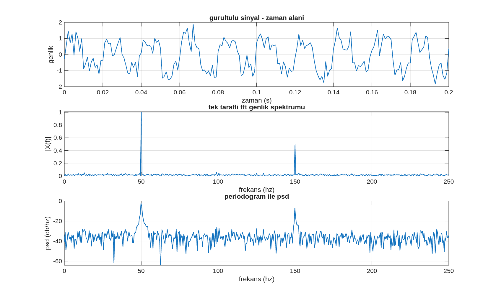
   
  <em>Görsel 2: Beyaz Gaussian gürültüsü içeren çoklu sinüs sinyalinin zaman alanı, tek taraflı FFT genlik spektrumu ve Periodogram PSD çıktısı. Periodogram, genlik spektrumundaki baskın bileşenleri (50 Hz ve 150 Hz) güç yoğunluğu (dB/Hz) cinsinden ifade ederek gürültü tabanından ayırma imkanı tanımaktadır.</em>

### Periodogram Tahmininin Güvenilirlik Sorunu
Periodogram, istatistiksel açıdan **tutarsız (inconsistent)** bir tahmin edicidir. Sinyal uzunluğu ($N$) sonsuza giden sınırda artsa bile, periodogram tahmininin varyansı sıfıra yaklaşmaz; spektrumda rastgele yüksek frekanslı dalgalanmalar (salınımlar) kalmaya devam eder. Bu durum, gürültü pürüzlerinin gerçek spektral piklerle karıştırılmasına yol açarak analizin doğruluğunu gölgelemektedir.

  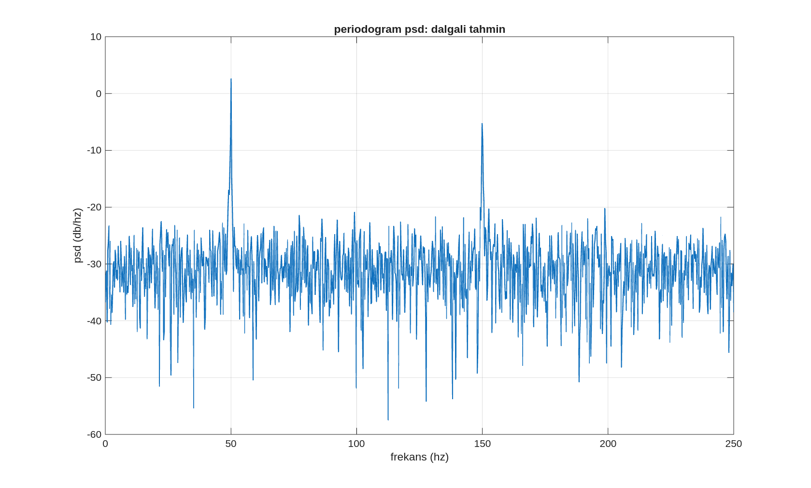
   
  <em>Görsel 3: Yüksek gürültü çarpanına sahip bir sinyalin periodogram spektrumu. Grafikte net bir şekilde gözlemlenen yüksek varyanslı dalgalı yapı, periodogram tahmin edicisinin istatistiksel tutarsızlığının ve tek bir veri kaydına doğrudan bağımlılığının bir sonucudur.</em>

---

## 4. Welch Yöntemi ile Spektrum Kararlılığının Sağlanması

Periodogram tahmin edicisinin yüksek varyans problemini çözmek amacıyla Peter Welch tarafından geliştirilen **Welch Yöntemi (Averaged Modified Periodogram)**, sinyali örtüşen alt segmentlere bölerek ortalama alma mantığına dayanır. Varyansın azaltılması sürecinde şu adımlar izlenmektedir:
1. **Segmentasyon:** Toplam $N$ örnekten oluşan sinyal, $M$ uzunluğunda $K$ adet alt segmente ayrılır.

2. **Örtüşme (Overlapping):** Segmentler $D$ kaydırma ile %50–%75 oranında örtüşecek şekilde seçilir.

3. **Pencereleme (Windowing):** Her segmente spektral sızıntıyı azaltmak için pencere fonksiyonu $w[n]$ (Hann, Hamming vb.) uygulanır.

4. **Değiştirilmiş Periodogram:** Her bir pencereleme işlemine tabi tutulmuş segment için ayrı ayrı periodogram hesaplanır. $i.$ segmente ait değiştirilmiş periodogram şu şekildedir:

$$
\tilde{P}_i(f)=\frac{1}{f_s M U}\left|\sum_{n=0}^{M-1} x_i[n]\,w[n]\,e^{-j2\pi f \frac{n}{f_s}}\right|^2
$$

Burada $U$, pencere fonksiyonunun enerji normalizasyon faktörüdür:

$$
U = \frac{1}{M}\sum_{n=0}^{M-1} |w[n]|^2
$$

5. **Ortalama Alma (Welch PSD):** Elde edilen tüm bağımsız değiştirilmiş periodogramların aritmetik ortalaması alınarak nihai Welch PSD tahmini elde edilir:

$$
\hat{P}_{Welch}(f)=\frac{1}{K}\sum_{i=0}^{K-1} \tilde{P}_i(f)
$$

$$P_{\text{Welch}}(f) = \frac{1}{K} \sum_{i=0}^{K-1} \tilde{P}_i(f)$$

Ortalama alma işlemi sayesinde, spektrum tahmininin varyansı segment sayısı ($K$) ile ters orantılı olarak azalır ve kararlı bir spektral eğri elde edilir.

  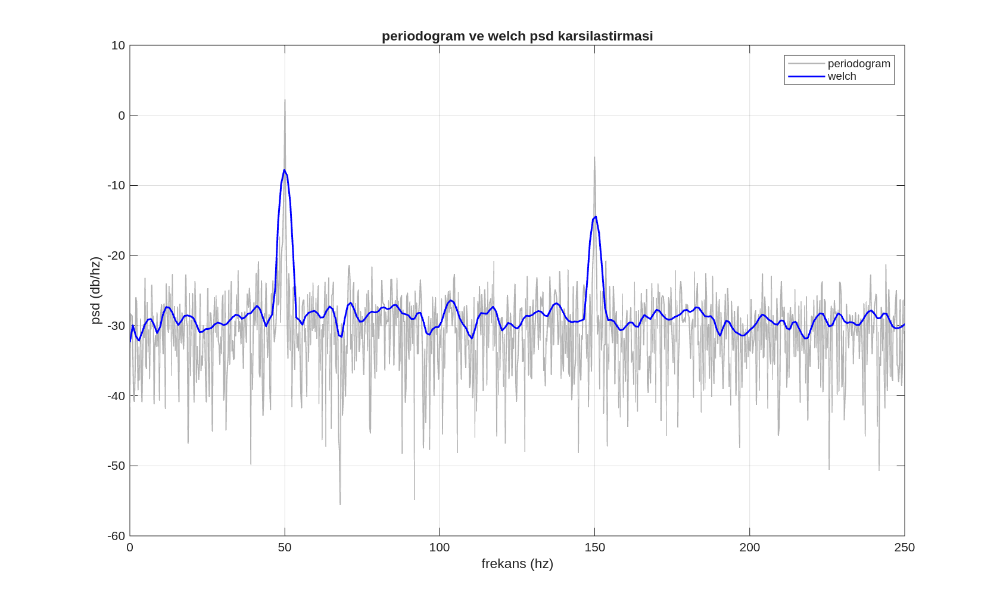
   
  <em>Görsel 4: Klasik Periodogram (gri) ile Welch Yöntemi (mavi) PSD tahminlerinin doğrudan karşılaştırılması. Welch yöntemi, alt segmentlerin ortalamasını alarak rastgele gürültü salınımlarını baskılamış, sinyalin deterministik bileşenlerini (50 Hz ve 150 Hz) pürüzsüz ve yüksek güvenilirlikte ortaya koymuştur.</em>

---

## 5. Welch Yöntemi Parametreleri ve Spektral Ödünleşimler

Welch yönteminin spektral tahmin kalitesi; seçilen segment uzunluğu ($M$), örtüşme oranı ve pencere fonksiyonunun geometrisine doğrudan bağlıdır. Bu parametrelerin belirlenmesinde istatistiksel bir ödünleşim (trade-off) söz konusudur:

*   **Uzun Segment Seçimi ($M \uparrow$):** Frekans çözünürlüğünü artırır ($\Delta f \approx f_s / M$). Ancak toplam segment sayısı ($K$) azalacağı için ortalama alma etkisi zayıflar ve varyans (dalgalanma) artar.
*   **Kısa Segment Seçimi ($M \downarrow$):** Toplam segment sayısını artırarak varyansı düşürür, daha pürüzsüz bir spektrum sunar. Ancak her bir segmentteki veri uzunluğu azaldığı için frekans çözünürlüğü düşer ve birbirine yakın spektral bileşenler tek bir pik altında birleşerek ayırt edilemez hale gelir.

  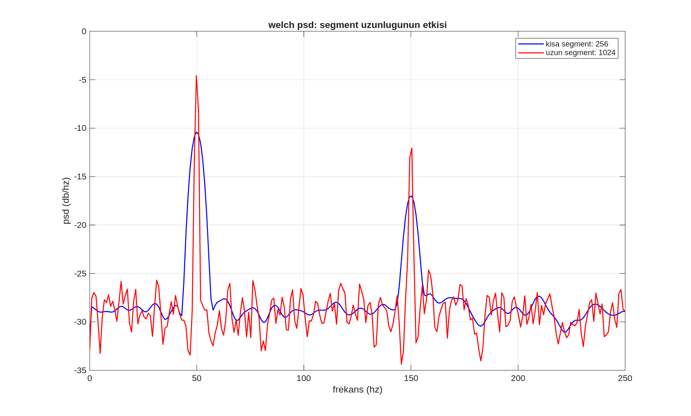
   
  <em>Görsel 5: Farklı segment uzunluklarının (256 ve 1024 örnek) Welch PSD çıktısı üzerindeki etkisi. 256 örnek uzunluğundaki kısa segment mimarisi (mavi) daha fazla varyans azaltımı sağlayarak pürüzsüz bir eğri sunarken, 1024 örnek uzunluğundaki uzun segment mimarisi (kırmızı) pik noktalarını daha dar ve yüksek çözünürlükte sunmakta ancak gürültü dalgalanmalarını daha belirgin hale getirmektedir.</em>

---

## 6. Gerçek Zamanlı Verilerde Welch PSD Uygulamaları

Sentetik sinyallerin ardından, Welch yönteminin etkinliği ses akustik verileri ve endüstriyel döner ekipman arıza analiz standartlarından biri olan CWRU motor titreşim verileri üzerinde test edilmiştir.

### 6.1. Akustik Sinyal Analizi
İnsan konuşma sinyali, doğası gereği durağan olmayan bir yapıya sahiptir. Belirli zaman dilimlerindeki konuşma enerjisinin frekans eksenindeki ortalama izdüşümü Welch PSD ile incelenebilmektedir. İnsan sesinin spektral enerjisinin büyük bir kısmı düşük ve orta frekans bölgelerinde kümelenmektedir.

  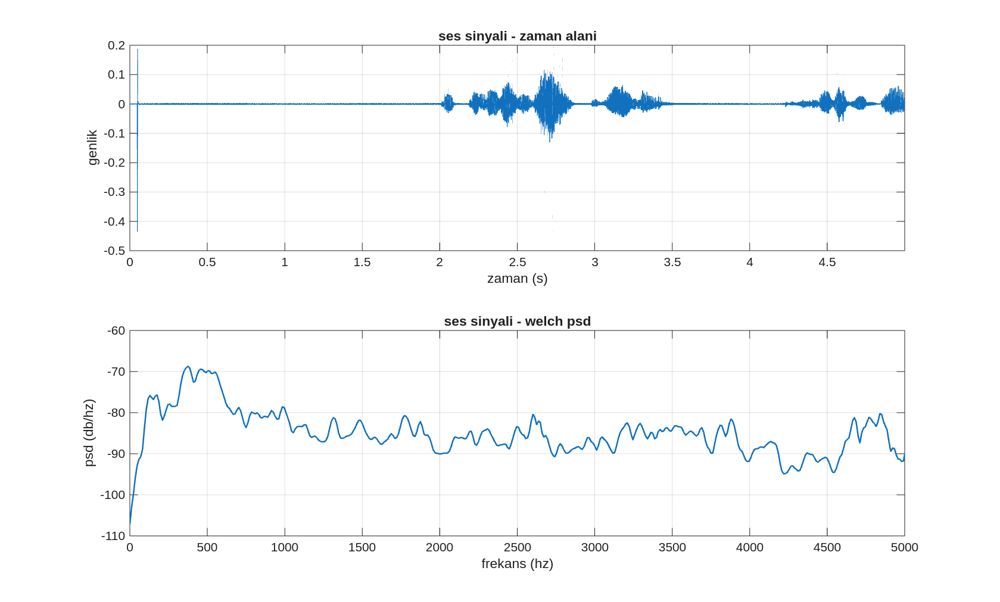
   
  <em>Görsel 6: Gerçek bir ses kaydının zaman alanı dalga şekli (üst) ve Welch PSD profili (alt). Alt spektrum incelendiğinde, enerjinin 0–500 Hz aralığında (temel frekans ve ses telleri karakteristik piki) ve 500–1500 Hz aralığında (konuşmanın anlaşılırlığını sağlayan akustik formant rezonansları) yoğunlaştığı görülmektedir.</em>

### 6.2. Mekanik Titreşim Sinyal Analizi
CWRU (Case Western Reserve University) rulman veri setinden alınan ivmeölçer verileri yüksek örnekleme frekansına ($48\text{ kHz}$) sahip olup, gürültü seviyesi oldukça yüksektir. Zaman alanında karmaşık ve stokastik görünen bu veriler, Welch PSD aracılığıyla yapısal bileşenlerine ayrıştırılabilmektedir.

  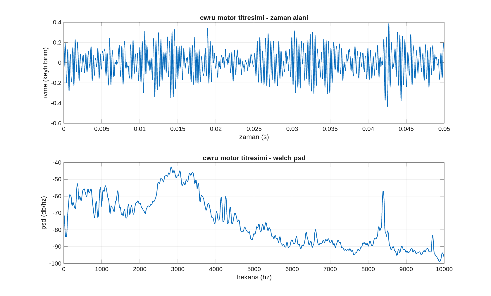
   
  <em>Görsel 7: Motor titreşim verisinin zaman alanı ivmelenme grafiği (üst) ve geniş bantlı Welch PSD spektrumu (alt). 8–9 kHz civarındaki geniş spektral tepe noktası, sistemin mekanik rezonans modlarına veya yapısal rulman elemanlarının darbe frekans karakteristiğine işaret etmektedir.</em>

---

## 7. Kısa Zamanlı Fourier Dönüşümü (STFT) ve Spektrogram

Welch yöntemi spektrum tahminini stabilize etse de, tüm zaman pencerelerinden gelen bilgileri ortaladığı için zamansal yerleşim bilgisini tamamen yok eder. Durağan olmayan sinyallerin zaman içindeki spektral değişimini izlemek amacıyla **Kısa Zamanlı Fourier Dönüşümü (STFT - Short-Time Fourier Transform)** geliştirilmiştir. STFT, sinyal üzerinde sabit uzunlukta bir pencere fonksiyonunu zaman ekseninde kaydırarak, her bir zaman dilimi için yerel Fourier dönüşümleri hesaplar. Sürekli zamanlı STFT ifadesi şu şekildedir:

$$X(t, f) = \int_{-\infty}^{\infty} x(\tau) w(\tau - t) e^{-j2\pi f \tau} d\tau$$

Burada $w(\tau - t)$, $t$ anı etrafında konumlandırılmış zaman kaymalı pencere fonksiyonudur. Ayrık zamanlı sistemlerde ise dönüşüm şu formülü alır:

$$X[m, k] = \sum_{n=-\infty}^{\infty} x[n] w[n - mR] e^{-j2\pi \frac{kn}{N_f}}$$

Formüldeki $R$ parametresi pencerenin kayma miktarını (hop size), $N_f$ ise FFT noktasını temsil eder. Elde edilen iki boyutlu karmaşık matrisin genliğinin karesi **Spektrogram** haritası olarak tanımlanır:

$$\text{Spectrogram}(t, f) = |X(t, f)|^2$$

Spektrogram; yatay eksende zamanı, dikey eksende frekansı ve renk yoğunluğunda ise o zaman-frekans koordinatındaki spektral güç yoğunluğunu (dB ölçeğinde) gösteren üç boyutlu bir bilgi uzayı sunar.

  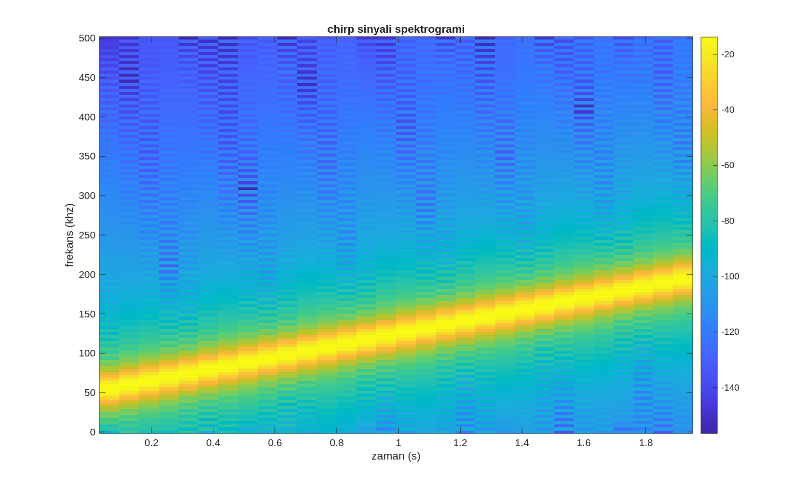
   
  <em>Görsel 8: Frekansı zamanla doğrusal olarak 50 Hz'den 200 Hz'e yükselen bir chirp sinyalinin spektrogramı. Parlak (sarı/yeşil) renk izinin zamanla yukarı doğru doğrusal bir eğimle ilerlemesi, sinyalin anlık frekansının zamana bağlı değişimini net bir şekilde ortaya koymaktadır. Geleneksel FFT bu doğrusal takibi yapamaz.</em>

---

## 8. Zaman-Frekans Çözünürlüğü ve Belirsizlik İlkesi

STFT analizi, pencere uzunluğunun seçimine bağlı olarak matematiksel bir fiziksel sınırlamaya tabidir. Bu durum, kuantum mekaniğindeki Heisenberg Belirsizlik Prensibi'nin sinyal işlemedeki karşılığı olan **Gabor Limiti (Zaman-Frekans Belirsizlik İlkesi)** ile açıklanır. Bir sinyalin hem zaman çözünürlüğü ($\Delta t$) hem de frekans çözünürlüğü ($\Delta f$) aynı anda sonsuz hassasiyetle iyileştirilemez. İki çözünürlük parametresinin çarpımı alt bir sınır değerle kısıtlanmıştır:

$$\Delta t \cdot \Delta f \ge \frac{1}{4\pi}$$

Bu ilkenin pratik analiz süreçlerine yansıması şu şekildedir:
*   **Dar/Kısa Pencere Seçimi ($\Delta t \downarrow$):** Sinyal çok dar zaman dilimlerinde incelendiği için zaman çözünürlüğü mükemmeldir; ani geçici olayların (transient) oluştuğu anlar hassas belirlenir. Ancak veri uzunluğu azaldığı için frekans çözünürlüğü zayıflar ($\Delta f \uparrow$), frekans eksenindeki izler kalınlaşır ve yayvanlaşır.
*   **Geniş/Uzun Pencere Seçimi ($\Delta t \uparrow$):** Her pencerede çok sayıda örnek yer aldığı için frekans çözünürlüğü son derece yüksektir ($\Delta f \downarrow$); spektral çizgiler ince ve keskin görünür. Ancak zaman içerisindeki hızlı değişimler tek bir pencere içinde harmanlandığı için zaman çözünürlüğü zayıflar, zamansal sınır çizgileri bulanıklaşır.

  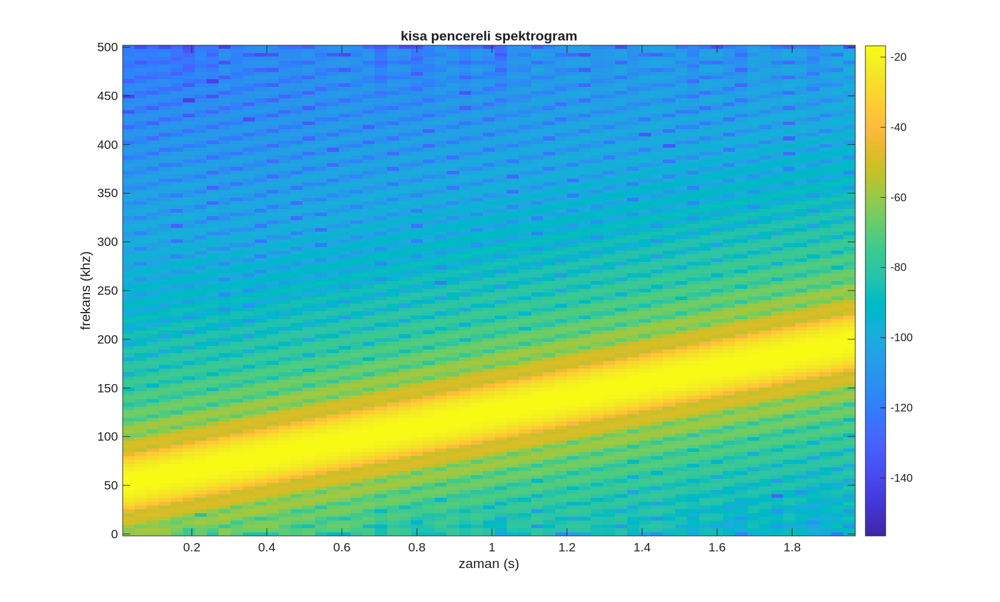
  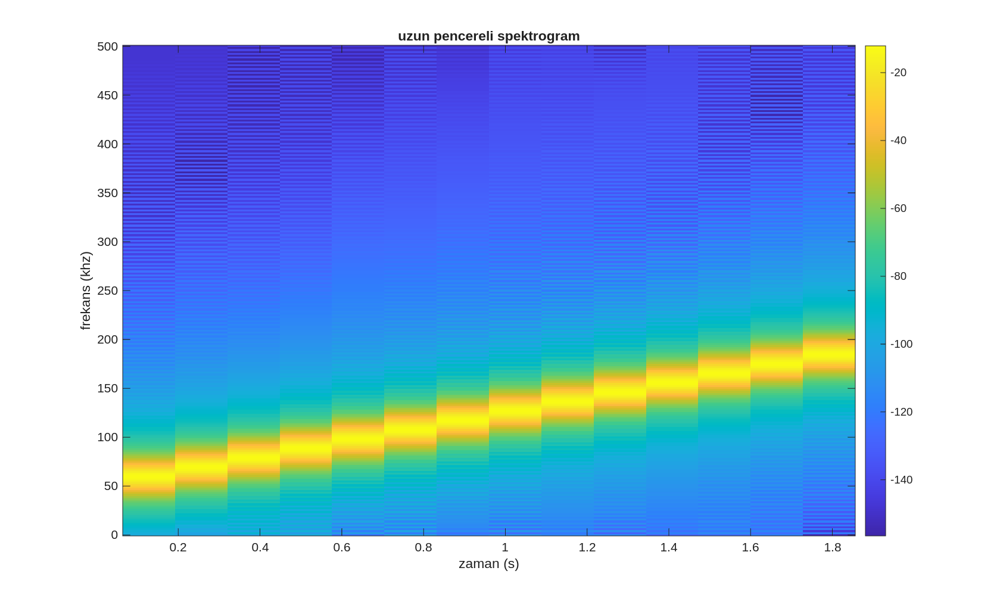
   
  <em>Görsel 9 & 10: Aynı doğrusal chirp sinyalinin kısa pencere (sol) ve uzun pencere (sağ) kullanılarak elde edilen spektrogram çıktılarının karşılaştırılması. Kısa pencere mimarisinde zaman eksenindeki adımlar keskin ancak frekans bandı geniş (yayvan) iken; uzun pencere mimarisinde frekans çizgisi son derece ince ve net, ancak zaman eksenindeki geçiş sınırları daha belirsiz ve yayılmıştır.</em>

---

## 9. Gerçek Zamanlı Verilerde Spektrogram Analizi

Durağan olmayan karakteristiğin en belirgin gözlemlendiği alan olan insan konuşma sinyalleri, STFT ve spektrogram haritalama yöntemleriyle analiz edilmiştir. Konuşma süreci boyunca oluşan sessizlik anları, ünlü harflerin harmonik yapıları ve ünsüz harflerin geniş bantlı gürültü benzeri yapıları spektrogram üzerinde ayırt edilebilmektedir.

  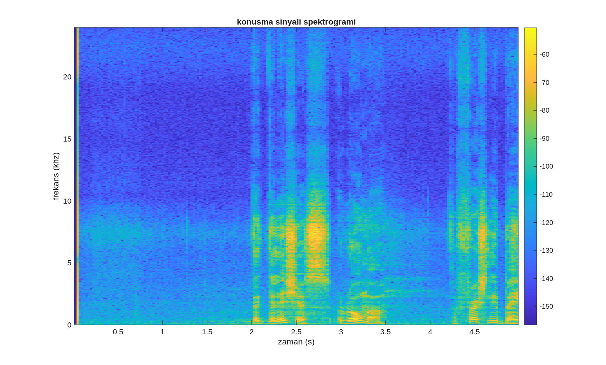
   
  <em>Görsel 11: Gerçek bir konuşma sinyalinin spektrogram haritası. Yatay eksende zaman (saniye), dikey eksende frekans (kHz) ve renk skalasında güç seviyesi (dB) yer almaktadır. Grafik üzerinde 0–2 saniye arasındaki mavi homojen bölge sessizlik/arka plan gürültü tabanını; 2.1–3.0 saniye ve 4.2 saniye sonrasındaki parlak sarı düşey sütunlar ise konuşma aktivitesinin gerçekleştiği anları ve bu anlardaki baskın anlık frekans formantlarını göstermektedir.</em>

---

## 10. Sonuç ve Metodolojik Seçim Kriterleri

Sinyal işleme mimarilerinde doğru spektral analiz yönteminin seçimi, sinyalin fiziksel doğasına ve hedeflenen bilgi türüne bağlı olarak gerçekleştirilmelidir. Süreç şu şekilde özetlenmektedir:

1.  Sinyal zaman boyunca istatistiksel olarak değişmiyorsa (durağan süreç), **Klasik FFT** doğrudan frekans bileşenlerini ortaya koymada en etkin yöntemdir.
2.  Sinyal yüksek oranda rastgele gürültü içeriyorsa ve spektral bileşenlerin güç dağılımının kararlı bir tahmini isteniyorsa, periodogram varyansını minimize eden **Welch Yöntemi** tercih edilmelidir.
3.  Sinyal zamanla değişen spektral parametrelere sahipse (durağan olmayan süreç) ve frekans bileşenlerinin anlık değişim zamanları aranıyorsa, **Kısa Zamanlı Fourier Dönüşümü (STFT) ve Spektrogram** analiz mimarisi kullanılmalıdır.
